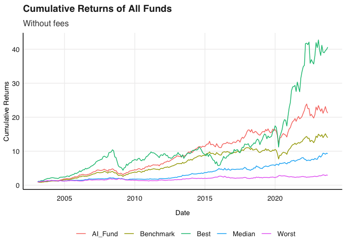
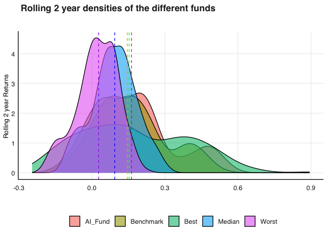
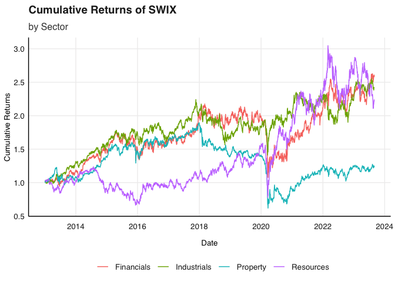
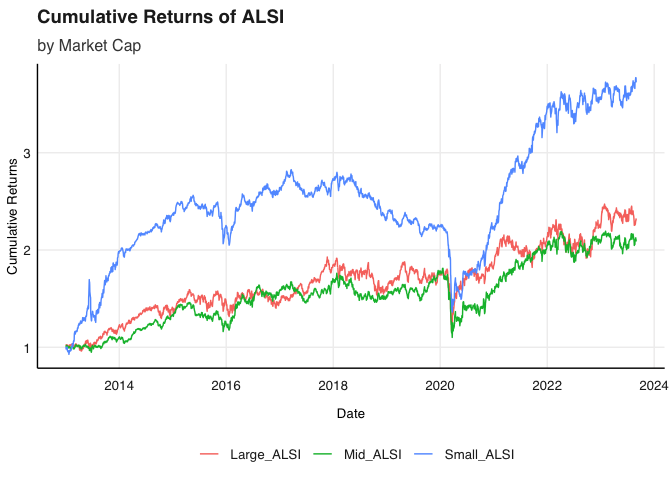
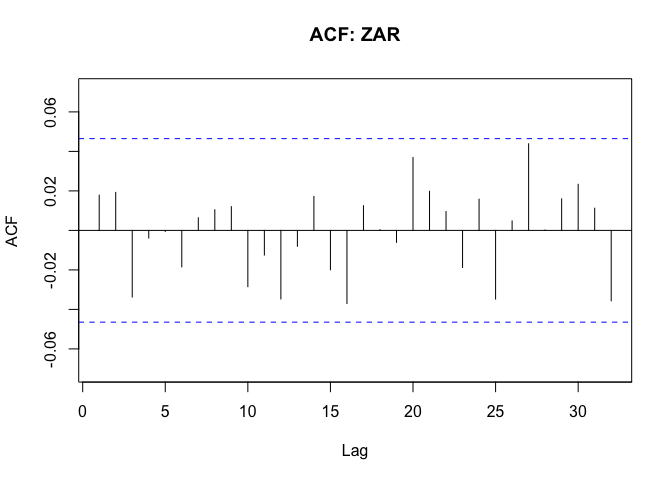

# Purpose

This is the READMe of my practical Examination for Financial
Econometrics

``` r
rm(list = ls()) # Clean your environment:
gc() # garbage collection - It can be useful to call gc after a large object has been removed, as this may prompt R to return memory to the operating system.
```

    ##          used (Mb) gc trigger (Mb) limit (Mb) max used (Mb)
    ## Ncells 466370 25.0     997834 53.3         NA   669302 35.8
    ## Vcells 879387  6.8    8388608 64.0      16384  1840208 14.1

``` r
library(tidyverse)
```

    ## ── Attaching packages ─────────────────────────────────────── tidyverse 1.3.2 ──
    ## ✔ ggplot2 3.4.0     ✔ purrr   1.0.2
    ## ✔ tibble  3.2.1     ✔ dplyr   1.1.2
    ## ✔ tidyr   1.3.0     ✔ stringr 1.5.0
    ## ✔ readr   2.1.4     ✔ forcats 0.5.2
    ## ── Conflicts ────────────────────────────────────────── tidyverse_conflicts() ──
    ## ✖ dplyr::filter() masks stats::filter()
    ## ✖ dplyr::lag()    masks stats::lag()

``` r
list.files('Question 1/code/', full.names = T, recursive = T) %>% .[grepl('.R', .)] %>% as.list() %>% walk(~source(.))
list.files('Question 2/code/', full.names = T, recursive = T) %>% .[grepl('.R', .)] %>% as.list() %>% walk(~source(.))
list.files('Question 3/code/', full.names = T, recursive = T) %>% .[grepl('.R', .)] %>% as.list() %>% walk(~source(.))
list.files('Question 4/code/', full.names = T, recursive = T) %>% .[grepl('.R', .)] %>% as.list() %>% walk(~source(.))
list.files('Question 5/code/', full.names = T, recursive = T) %>% .[grepl('.R', .)] %>% as.list() %>% walk(~source(.))
list.files('Question 6/code/', full.names = T, recursive = T) %>% .[grepl('.R', .)] %>% as.list() %>% walk(~source(.))
```

# Question 1: AI Fund

Please note that I saved my powerpoint in my main question folder as I
have gitignored my data folder so it will not be uploaded to github.

``` r
# Let's read in the data first and foremost and have a look at it
library(tidyverse)
library(lubridate)
```

    ## Loading required package: timechange

    ## 
    ## Attaching package: 'lubridate'

    ## The following objects are masked from 'package:base':
    ## 
    ##     date, intersect, setdiff, union

``` r
library(tbl2xts) 
library(PerformanceAnalytics)
```

    ## Loading required package: xts

    ## Loading required package: zoo

    ## 
    ## Attaching package: 'zoo'

    ## The following objects are masked from 'package:base':
    ## 
    ##     as.Date, as.Date.numeric

    ## 
    ## ######################### Warning from 'xts' package ##########################
    ## #                                                                             #
    ## # The dplyr lag() function breaks how base R's lag() function is supposed to  #
    ## # work, which breaks lag(my_xts). Calls to lag(my_xts) that you type or       #
    ## # source() into this session won't work correctly.                            #
    ## #                                                                             #
    ## # Use stats::lag() to make sure you're not using dplyr::lag(), or you can add #
    ## # conflictRules('dplyr', exclude = 'lag') to your .Rprofile to stop           #
    ## # dplyr from breaking base R's lag() function.                                #
    ## #                                                                             #
    ## # Code in packages is not affected. It's protected by R's namespace mechanism #
    ## # Set `options(xts.warn_dplyr_breaks_lag = FALSE)` to suppress this warning.  #
    ## #                                                                             #
    ## ###############################################################################

    ## 
    ## Attaching package: 'xts'

    ## The following objects are masked from 'package:dplyr':
    ## 
    ##     first, last

    ## 
    ## Attaching package: 'PerformanceAnalytics'

    ## The following object is masked from 'package:graphics':
    ## 
    ##     legend

``` r
library(fmxdat)

ASISA <- read_rds("Question 1/data/ASISA_Rets.rds")
BM <- read_rds("Question 1/data/Capped_SWIX.rds")
AI_Fund <- read_rds("Question 1/data/AI_Max_Fund.rds")

# View(ASISA)
# View(BM)
# View(AI_Fund)
#Notes: We are given monthly returns for all funds 
```

``` r
#Lets start by identifying what I actually want to get done:
# 1) Plot the cumulative returns for all of the funds
# 2) then Plot the actively managed fund including fees
# 3) Plot the 3 year rolling returns (including fees)
# 4) Try and plot the actual distribution of the returns for all three funds
```

``` r
#This code chunk wrangles the data to join all of the returns so we can plot them
# First we need to select managers to compare to, I think it would be a good idea to  get the top of active managers funds as well as the bottom and then  compare to the AI and capped SWIX

strat_active <- ASISA %>% 
    filter(Index == "No") %>% #we do not want any indecies
    filter(FoF == "No") %>%  #We do not want any FoFs
    select(-Index, - FoF)

#Now i need to get the tickers of the funds that have existed since 2005
ticker_to_include <- strat_active %>% 
     filter(date < ymd(20050101)) %>% 
    pull(Fund)

best_active <- strat_active %>% 
    arrange(date) %>% 
    filter(Fund %in% ticker_to_include) %>% #want to make sure that the funds have been around for a comparable amount of time
    group_by(Fund) %>% 
    mutate(avg = mean(Returns)) %>%
    ungroup() %>% # Now we have the average for all the funds 
    filter(date == last(date)) %>% 
    filter(date > lubridate::ymd(20230101)) %>% # I only want funds that exist in 2023 to compare to AI
    filter(avg == max(avg)) %>% #Get the best fund
    pull(Fund)

worst_active <- strat_active %>% 
    arrange(date) %>% 
    filter(Fund %in% ticker_to_include) %>%
    group_by(Fund) %>% 
    mutate(avg = mean(Returns)) %>%
    ungroup() %>% # Now we have the average for all the funds 
    filter(date == last(date)) %>% 
    filter(date > lubridate::ymd(20230101)) %>% # I only want funds that exist in 2023 to compare to AI
    filter(avg == min(avg)) %>% #Get the worst fund
    pull(Fund)

median_active <- 
  strat_active %>% 
    arrange(date) %>% 
    filter(Fund %in% ticker_to_include) %>%
    group_by(Fund) %>% 
    mutate(avg = mean(Returns)) %>%
    ungroup() %>% # Now we have the average for all the funds 
    filter(date == last(date)) %>% 
    filter(date > lubridate::ymd(20230101)) %>% # I only want funds that exist in 2023 to compare to AI
    arrange(avg) %>% # Get the funds with the median average return
    slice(n()/2) %>% 
    pull(Fund)


#Now just clean the managers df
managers <- strat_active %>% 
    filter(Fund %in% c(worst_active, best_active, median_active)) %>% 
    spread(Fund, Returns) %>% 
    rename("Best" = "N924", "Worst" = "V906", "Median" = "B444")


#now I can join all three of the dfs so that I have 1 df to use with all of the returns of interest
full_df <- 
    
    left_join(AI_Fund, managers, by = "date") %>% 
    left_join(., BM %>% select(-Tickers) %>% rename("Benchmark"= "Returns"), by = "date") 

#lets be fancy and use the impute_missing_returns func from the tut to get the returns for the active funds
final_df <- impute_missing_returns(full_df, impute_returns_method = "Drawn_Distribution_Own")

#last but not least lets get it in tidy format
final_df <- final_df %>% gather(Tickers, ret, -date)

#Now we are off to the races and can plot the returns
```

## Fees

``` r
#Lets now just plot the cumulative returns
cum_plot<- final_df %>% 
    arrange(date) %>% 
    group_by(Tickers) %>% 
    mutate(cum_rts = cumprod(1+ret)) %>% 
    select(-ret) %>% 
    ungroup() %>% 
    ggplot()+
    geom_line(aes(date, cum_rts, color = Tickers))+
    fmxdat::theme_fmx()+
    labs(title = "Cumulative Returns of All Funds", subtitle = "Without fees", x = "Date", y = "Cumulative Returns")
```

    ## Warning in loadfonts_win(quiet = quiet): OS is not Windows. No fonts registered
    ## with windowsFonts().

``` r
  #Save it to the graphs folder to use in the powerpoint
# ggsave(file.path("graphs/","Cumulative Returns of All Funds.png"), plot = cum_plot, width = 6, height = 5 )
  
cum_plot
```



``` r
#Now lets add fees on to the actively manaaed portfolios, lets take a fee of 200bps
#Lets include the fee converter func from the prac
 feeconverter <- function(x, Ann_Level) (1+x)^(1/Ann_Level)-1

managers_fees <- managers %>% 
    gather(Tickers, returns, -date) %>% 
    mutate(fee_rts = returns - feeconverter(200*1e-4, Ann_Level = 12)) %>% #using a fee of 25bps
    select(-returns) %>% 
    spread(Tickers, fee_rts) 

#Now we can just join this to the final df
fee_finaldf <- final_df %>% 
    spread(Tickers, ret) %>% 
    select(-Best, -Worst, -Median) %>% 
    left_join(., managers_fees, by = "date")

#Again we can impute missing values
fee_finaldf<- impute_missing_returns(fee_finaldf, impute_returns_method = "Drawn_Distribution_Own")

#Make it tidy to plot again
fee_finaldf<-fee_finaldf %>% 
    gather(Tickers, ret, -date) 

Cum_fee_plot<-fee_finaldf %>% 
arrange(date) %>% 
    group_by(Tickers) %>% 
    mutate(cum_rts = cumprod(1+ret)) %>% 
    select(-ret) %>% 
    ungroup() %>% 
    ggplot()+
    geom_line(aes(date, cum_rts, color = Tickers))+
    fmxdat::theme_fmx()+
    labs(title = "Cumulative Returns of All Funds", subtitle = "With fees", x = "Date", y = "Cumulative Returns")
```

    ## Warning in loadfonts_win(quiet = quiet): OS is not Windows. No fonts registered
    ## with windowsFonts().

``` r
#Save it to the graphs folder to use in the powerpoint
# ggsave(file.path("graphs/","Cumulative Returns of All Funds with fees.png"), plot = Cum_fee_plot, width = 6, height = 5 )

Cum_fee_plot
```

 \##
Rolling Returns

``` r
library(RcppRoll)

#We have monthly returns after fees so we can use the Rcpproll package to get the rolling returns
roll_fee <- fee_finaldf %>% 
    group_by(Tickers) %>% 
    mutate(RollRets = RcppRoll::roll_prod(1 + ret, 24, fill = NA, 
    align = "right")^(12/24) - 1) %>% 
    group_by(date) %>% filter(any(!is.na(RollRets))) %>% 
ungroup()

roll_ret_plot<- 
roll_fee %>% 
ggplot() + 
geom_line(aes(date, RollRets, color = Tickers), alpha = 0.7, 
    size = 1) + 
labs(title = " Rolling 2 Year Annualized Returns", 
    subtitle = "", x = "", y = "Rolling 2 year Returns "
    ) + fmxdat::theme_fmx()
```

    ## Warning: Using `size` aesthetic for lines was deprecated in ggplot2 3.4.0.
    ## ℹ Please use `linewidth` instead.
    ## This warning is displayed once every 8 hours.
    ## Call `lifecycle::last_lifecycle_warnings()` to see where this warning was
    ## generated.

    ## Warning in loadfonts_win(quiet = quiet): OS is not Windows. No fonts registered
    ## with windowsFonts().

``` r
#Save it to the graphs folder to use in the powerpoint
# ggsave(file.path("graphs/","Rolling 2 Year Annualized Returns.png"), plot = roll_ret_plot, width = 6, height = 5 )


roll_ret_plot
```


``` r
#Lets now try and plot the rolling density function with the medians 
roll_density<- roll_fee %>% 
ggplot(aes(x = RollRets)) + 
geom_density(aes(fill = Tickers), alpha =0.6)+
      geom_vline(data = . %>% filter(Tickers == "AI_Fund") %>% summarise(median = median(RollRets)),
             aes(xintercept = median),
             linetype = "dashed", color = "red")+
      geom_vline(data = . %>% filter(Tickers == "Benchmark") %>% summarise(median = median(RollRets)),
             aes(xintercept = median),
             linetype = "dashed", color = "orange")+
      geom_vline(data = . %>% filter(Tickers == "Best") %>% summarise(median = median(RollRets)),
             aes(xintercept = median),
             linetype = "dashed", color = "green")+
      geom_vline(data = . %>% filter(Tickers == "Worst") %>% summarise(median = median(RollRets)),
             aes(xintercept = median),
             linetype = "dashed", color = "purple")+
    geom_vline(data = . %>% filter(Tickers == "Median") %>% summarise(median = median(RollRets)),
             aes(xintercept = median),
             linetype = "dashed", color = "blue")+
    labs(title = " Rolling 2 year densities of the different funds", 
    subtitle = "", x = "", y = "Rolling 2 year Returns "
    ) + fmxdat::theme_fmx()
```

    ## Warning in loadfonts_win(quiet = quiet): OS is not Windows. No fonts registered
    ## with windowsFonts().

``` r
#Save it to the graphs folder to use in the powerpoint
# ggsave(file.path("graphs/","Rolling 2 year densities of the different funds.png"), plot = roll_density, width = 6, height = 5 )

roll_density
```



## Rolling annualized Standard Deviation

``` r
#Now I do the same thing to get the rolling SD
rollsd_fee <- fee_finaldf %>% 
    group_by(Tickers) %>%
    mutate(RollSD = RcppRoll::roll_sd(1 + ret, 36, fill = NA, align = "right") * 
    sqrt(12)) %>% 
filter(!is.na(RollSD))

sd_plot<- rollsd_fee %>% 
ggplot() + 
geom_line(aes(date, RollSD, color = Tickers), alpha = 0.7, size = 1.25) + 
    
labs(title = "Rolling 3 Year Annualized SD ", x = "", y = "Rolling 2 year SD") + theme_fmx()
```

    ## Warning in loadfonts_win(quiet = quiet): OS is not Windows. No fonts registered
    ## with windowsFonts().

``` r
#Save it to the graphs folder to use in the powerpoint
# ggsave(file.path("graphs/","Rolling 2 Year Annualized S.png"), plot = sd_plot, width = 6, height = 5 )


sd_plot
```


# Question 2: Currency Hedging Analysis

``` r
library(tidyverse)
library(fmxdat)
library(PerformanceAnalytics)
library(tbl2xts)
Indexes <- read_rds("Question 2/data/Cncy_Hedge_Assets.rds")
ZAR <- read_rds("Question 2/data/Monthly_zar.rds")
```

## Introduction

I start by replicating the figure given in the article. I then construct
a hedged and un-hedged portfolio, calculate their three year rolling
returns and standard deviation. Lastly, I compare the annualised returns
and standard deviations over three different time periods to show that
the results hold.

``` r
#Lets start by constructing the porfolio, I want to optimise it using quadprog
# library(quadprog)
# #need to get rid of the dates to estimate Sigma
# return_mat_nodate <- data.matrix(Indexes[,-1])
# 
# library(RiskPortfolios)
# library(fitHeavyTail)
# #now use the RiskPortfolios or fitheavy tail packages to get sigma
# 
# HTT <- fitHeavyTail::fit_mvt(return_mat_nodate)
# Sigma <- HTT$cov
# mu <- HTT$mu
# 
# #make sure that the matrix is positive defninite
# Sigma <- as.matrix( Matrix::nearPD(Sigma)$mat)
# #now I am going to construct the amat and bvec to use quadprog to solve there are 4 assets where the first is global equity, the second is global bonds, the third is local equity and the last is local bonds therefore
# Amat <- matrix(c(1, 1, 0, 0, 1,
#                 1, 1, 0, 1, 0,
#                 1, 0, 1, 0, 1,
#                 1, 0, 1, 1, 0), 
#                  nrow = 4, 
#                  byrow = TRUE)
# bvec <- c(1, 0.3, 0.7, 0.4, 0.6 )
# 
# meq = 1 #only the first constraint must hold with equality
# w.opt <- 
#     quadprog::solve.QP(Dmat = Sigma,
#                             dvec = mu, 
#                             Amat = Amat, 
#                             bvec = bvec, 
#                             meq = meq)$solution
# w.opt
# 
# result.QP <- tibble(stocks = colnames(Sigma), weight = w.opt) 


# #That did not work so I am rarther going to use porfolio analytics to construct the optimal portfolio
# library(PortfolioAnalytics)
# library(tbl2xts)
# indexes <- Indexes %>% 
#     tbl_xts()
# 
# specifications <- portfolio.spec(colnames(indexes))
# specifications <- add.constraint(portfolio = specifications, type = "full_investment")
# specifications <- add.constraint(portfolio = specifications, type = "long_only")
# specifications <- add.constraint(portfolio = specifications, type = "group", groups = list(c(1,2)), group_max = 0.3, group_min = 0)
# specifications <- add.constraint(portfolio = specifications, type = "group", groups = list(c(3,4)), group_max = 0.7, group_min = 0)
# specifications <- add.constraint(portfolio = specifications, type = "group", groups = list(c(2,4)), group_max = 0.4, group_min = 0)
# specifications <- add.constraint(portfolio = specifications, type = "group", groups = list(c(1,3)), group_max = 0.6, group_min = 0)
# # specifications<- add.constraint(portfolio=specifications, type="box", min=0, max=c(0.18, 0.12, 0.42, 0.28))
# 
# rand_port <- random_portfolios(portfolio=specifications, permutations = 1000, rp_method ='sample')
# 
# optimal <- optimize.portfolio(R = indexes, portfolio = specifications, optimize_method = "random", rp = rand_port, trace = TRUE)

#This did not work either so i am just going to constrict the weighst by hand that fit the constraints eg offshore bonds can only be 30% of the 40% allocation to bonds

weights <- c(0.18, 0.12, 0.42, 0.28)

#now i am just adding a column with the weights and assuming it is an index rather than a portfolio so there are no rebalancing days
port_ret <- Indexes %>% 
    mutate(MSCI_ACWI_wt = 0.18) %>% 
    mutate(Bbg_Agg_wt = 0.12) %>% 
    mutate(J433_wt = 0.28) %>% 
    mutate(ALBI_wt= 0.28) %>% 
    mutate(port_ret =(MSCI_ACWI*MSCI_ACWI_wt)+ (Bbg_Agg*Bbg_Agg_wt)+ (J433*J433_wt)+(ALBI*ALBI_wt)) %>% 
    select(date, port_ret)

#Now I need to calculate the returns of the dollar rand exchange rate

ex_ret <- ZAR %>% 
    arrange(date) %>% 
    mutate(currency_ret = value/lag(value)-1) %>% 
    select(date, currency_ret) %>% 
    slice(-1)


#now we can join the two data frames
full_df <- port_ret %>% 
    left_join(., ex_ret, by = "date")
```

``` r
#In order to get the percentages on the graph we need to identify how many observations are in each section where the top and bottom left quadrant we also need to consider the fee which appears to be about three percent
countingdf <- full_df %>% 
    na.omit() #This just gets rid of the nas
no_obs <- nrow(countingdf) #get the total number of observations so that we can actually get the percentages

#top right quandrant percentage calculation
TR_perc <- countingdf %>% 
    filter(port_ret >0) %>% 
    filter(currency_ret>0) %>% 
    nrow()/no_obs*100 
TR_perc <- round(TR_perc,0)

#botom right quadrant percentage calculation
BR_perc <- countingdf %>% 
    filter(port_ret <0) %>% 
    filter(currency_ret>0) %>% 
    nrow()/no_obs*100 
 BR_perc<-   round(BR_perc,0)

#top left quandrant percentage calculation
TL_perc <- countingdf %>% 
    filter(port_ret >0) %>% 
    filter(currency_ret<0) %>% 
    nrow()/no_obs*100
 TL_perc<- round(TL_perc,0)

#bottom left quandrant percentage calculation
BL_perc <- countingdf %>% 
    filter(port_ret <0) %>% 
    filter(currency_ret<0) %>% 
    nrow()/no_obs*100 
  BL_perc<-  round(BL_perc,0)

#Top left with fees quandrant percentage calculation
TLF_perc <- countingdf %>% 
    filter(port_ret >0) %>% 
    filter(currency_ret< -0.03) %>% 
    nrow()/no_obs*100 
 TLF_perc<-   round(TLF_perc,0)

#Bottom left with fees quandrant percentage calculation
BLF_perc <- countingdf %>% 
    filter(port_ret <0) %>% 
    filter(currency_ret< -0.03) %>% 
    nrow()/no_obs*100  
  BLF_perc<-  round(BLF_perc,0)

library(ggExtra)
library(glue)
#Now lets actually try and get the plot from ghost 
scatter_plot <- ggplot(full_df)+
    annotate("rect", xmin= 0, xmax = -Inf, ymin = 0, ymax = Inf, fill ="orange", alpha =0.5)+#top left quandrant
    annotate("rect", xmin= 0, xmax = -Inf, ymin = 0, ymax = -Inf, fill ="red", alpha =0.5)+#bottom left quandrant
    annotate("rect", xmin= 0, xmax = Inf, ymin = 0, ymax = Inf, fill ="green", alpha =0.5)+#top right quandrant
    annotate("rect", xmin= 0, xmax = Inf, ymin = 0, ymax = -Inf, fill ="green", alpha =0.2)+#bottom left quandrant
    geom_point(aes(x = currency_ret, y = port_ret), colour = "grey", alpha = 0.8)+
    geom_smooth(aes(x = currency_ret, y = port_ret),method = "lm")+
    geom_hline(yintercept = 0)+
    geom_vline(xintercept = 0)+
    geom_vline(xintercept = -0.03, linetype = "dashed")+
    geom_label(aes(x = -0.1, y = 0.1, label = "Hedge works but, amplifies Volatility"), color = "black", size = 2)+
    geom_label(aes(x = -0.1, y = -0.1, label = "Best case for hedge:\\ higher return lower volatility"), color = "black", size = 2) +
    geom_label(aes(x = 0.1, y = 0.1, label = "Hedge throws away returns"), color = "black", size = 2) +
    geom_label(aes(x = 0.1, y = -0.1, label = "Hedge removes currency cushion"), color = "black", size = 2)+
    geom_label(aes(x = -0.17, y = 0.17, label = glue("{TL_perc}%")), color = "black", size = 3)+
    geom_label(aes(x = -0.17, y = -0.17, label = glue("{BL_perc}%")), color = "black", size = 3)+
    geom_label(aes(x = 0.17, y = 0.17, label = glue("{TR_perc}%")), color = "black", size = 3)+
    geom_label(aes(x = 0.17, y = -0.17, label = glue("{BR_perc}%")), color = "black", size = 3)+
    geom_label(aes(x = -0.17, y = 0.17, label = glue("{TL_perc}%")), color = "black", size = 3)+
    geom_label(aes(x = -0.05, y = -0.17, label = glue("{BLF_perc}%")), color = "black", size = 3)+
    geom_label(aes(x = -0.05, y = 0.17, label = glue("{TLF_perc}%")), color = "black", size = 3)+

    labs(title = "Scatter Plot of USD/ZAR and Portfolio returns ", x = "USD-ZAR Returns", y = "60-40 Local-Global Returns")+
    lims(x = c(-0.2, 0.2), y = c(-0.2, 0.2)) +  # Set axis limits
    theme_bw()


scatter_plot_density <- ggMarginal(scatter_plot, type = "density", margins = "both", fill = "blue")
```

    ## `geom_smooth()` using formula = 'y ~ x'

    ## Warning: Removed 73 rows containing non-finite values (`stat_smooth()`).

    ## `geom_smooth()` using formula = 'y ~ x'

    ## Warning: Removed 73 rows containing non-finite values (`stat_smooth()`).

    ## Warning: Removed 73 rows containing missing values (`geom_point()`).

    ## `geom_smooth()` using formula = 'y ~ x'

    ## Warning: Removed 73 rows containing non-finite values (`stat_smooth()`).
    ## Removed 73 rows containing missing values (`geom_point()`).

``` r
scatter_plot_density
```


# Volatility analysis

``` r
#Lets use the fee converter again assuming that there are fees for hedging assuming the same three percent as above
 feeconverter <- function(x, Ann_Level) (1+x)^(1/Ann_Level)-1

#The hedged return is exactly the return of the global assets less the fee to hedge
hedged<- Indexes %>% 
    mutate(MSCI_ACWI_wt = 0.18) %>% 
    mutate(Bbg_Agg_wt = 0.12) %>% 
    mutate(J433_wt = 0.28) %>% 
    mutate(ALBI_wt= 0.28) %>% 
    mutate(hedged_ret =(MSCI_ACWI*MSCI_ACWI_wt)+ (Bbg_Agg*Bbg_Agg_wt)+ (J433*J433_wt)+(ALBI*ALBI_wt) - feeconverter(300*1e-4, Ann_Level = 12)) %>% 
    select(date, hedged_ret)

unhedged <- Indexes %>% 
    left_join(., ex_ret, by ="date") %>% 
    filter(!is.na(currency_ret)) %>% 
    mutate(MSCI_ACWI_wt = 0.18) %>% 
    mutate(Bbg_Agg_wt = 0.12) %>% 
    mutate(J433_wt = 0.28) %>% 
    mutate(ALBI_wt= 0.28) %>% 
    mutate(unhedged_ret =((MSCI_ACWI*MSCI_ACWI_wt)+ (Bbg_Agg*Bbg_Agg_wt))*currency_ret + (J433*J433_wt)+(ALBI*ALBI_wt)) %>% #here the global assets are subject to the volatility of the rand
    select(date, unhedged_ret)

#Now we can join the dfs so we can compare the returns and the volatility
hedged_comp_df <-
    left_join(unhedged, hedged, by = "date") %>% 
    rename("Hedged"= "hedged_ret", "Unhedged"= "unhedged_ret")

#Lets get the annulised returns for both portfolios
#Start by getting tidy data
tidy_hedged <-hedged_comp_df
```

``` r
#Now lets plot the rollinf returns and SD
#Let's again use the RcppRoll package agin to get annualised reterns and volatility
library(RcppRoll)

roll_ret_hedge <- hedged_comp_df %>% 
    gather(Type, ret, -date) %>% #here type refers to whether it is hedged or not
    group_by(Type) %>% 
    mutate(RollRets = RcppRoll::roll_prod(1 + ret, 24, fill = NA, 
    align = "right")^(12/24) - 1) %>% 
    group_by(date) %>% filter(any(!is.na(RollRets))) %>% 
ungroup()

roll_ret_hedge_plot<- 
roll_ret_hedge %>% 
ggplot() + 
geom_line(aes(date, RollRets, color = Type), alpha = 0.7, 
    size = 1) + 
labs(title = " Rolling 2 Year Annualized Returns", 
    subtitle = "", x = "", y = "Rolling 2 year Returns "
    ) + fmxdat::theme_fmx()
```

    ## Warning in loadfonts_win(quiet = quiet): OS is not Windows. No fonts registered
    ## with windowsFonts().

``` r
roll_ret_hedge_plot
```

 Figure 2
incorporates the fee identified in the study and in Figure Figure 1.
Once the fee has been accounted for it is clear to see the that unhedged
portfolio almost always outperforms it’s hedged counterpart.

``` r
#Now lets get the rolling sd as a measure of volatility

roll_SD_hedge <-  hedged_comp_df %>% 
    gather(Type, ret, -date) %>% 
    group_by(Type) %>%
    mutate(RollSD = RcppRoll::roll_sd(1 + ret, 36, fill = NA, align = "right") * 
    sqrt(12)) %>% 
filter(!is.na(RollSD))

roll_SD_hedge_plot<- roll_SD_hedge %>% 
ggplot() + 
geom_line(aes(date, RollSD, color = Type), alpha = 0.7, size = 1.25) + 
    
labs(title = "Rolling 3 Year Annualized SD ", x = "", y = "Rolling 2 year SD") + theme_fmx()
```

    ## Warning in loadfonts_win(quiet = quiet): OS is not Windows. No fonts registered
    ## with windowsFonts().

``` r
roll_SD_hedge_plot
```

 If the
returns comparison was not convincing enough the comparison of a two
year rolling SD paints an even clearer picture. Throughout the entire
sample period the Hedged portfolio is more risky. Figures 4 and 5 only
strengthen this argument to show that the results are strong
irrespective of the lookback period. Finally the table at the end of the
question calculates the correlations of both portfolios to the USD/ZAR
exchange rate and finds that hedged portfolio is more negatively
correlated to the USD/ZAR exchange rate. This confirms the existence of
the paradox in volatility in that negatively correlated assets may
produce portfolio volatilities that are lower than the sum of its parts.

``` r
#Lets give that table a crack
#Lets get the annulised returns for both portfolios
#Start by getting tidy data
tidy_hedged <-hedged_comp_df %>% 
    gather(Type, ret, -date) %>% 
    tbl_xts(., cols_to_xts = ret, spread_by = Type)

#Now lets use the performance analytics package to get the annulized returns and std devs following the practical 

hedge_plot <- 
    bind_rows(
        tidy_hedged %>% tail(12) %>% PerformanceAnalytics::Return.annualized(., scale = 12) %>% data.frame() %>% mutate(Freq = "A"),
        tidy_hedged %>% tail(36) %>% PerformanceAnalytics::Return.annualized(., scale = 12) %>% data.frame() %>% mutate(Freq = "B"),
        tidy_hedged %>% tail(60) %>% PerformanceAnalytics::Return.annualized(., scale = 12) %>% data.frame() %>% mutate(Freq = "C")
    )%>% data.frame() %>% gather(Type, mu, -Freq)
to_string <- as_labeller(c(`A` = "1 Year", `B` = "3 Years", `C` = "5 Years"))

g <- hedge_plot %>% 
ggplot() + 
    
  geom_bar( aes(Type, mu, fill = Type), stat="identity") + 
    
  facet_wrap(~Freq, labeller = to_string, nrow = 1) + 
    
  labs(x = "", y = "Returns (Ann.)" )+
    theme_fmx()
```

    ## Warning in loadfonts_win(quiet = quiet): OS is not Windows. No fonts registered
    ## with windowsFonts().

``` r
g
```


``` r
#Now I plot a similar graph instead looking at the volatility
hedge_plot_SD <- 
    bind_rows(
        tidy_hedged %>% tail(12) %>% PerformanceAnalytics::StdDev.annualized(., scale = 12) %>% data.frame() %>% mutate(Freq = "A"),
        tidy_hedged %>% tail(36) %>% PerformanceAnalytics::StdDev.annualized(., scale = 12) %>% data.frame() %>% mutate(Freq = "B"),
        tidy_hedged %>% tail(60) %>% PerformanceAnalytics::StdDev.annualized(., scale = 12) %>% data.frame() %>% mutate(Freq = "C")
    )%>% data.frame() %>% gather(Type, mu, -Freq)
to_string <- as_labeller(c(`A` = "1 Year", `B` = "3 Years", `C` = "5 Years"))

Vol_annulised <- hedge_plot_SD %>% 
ggplot() + 
    
  geom_bar( aes(Type, mu, fill = Type), stat="identity") + 
    
  facet_wrap(~Freq, labeller = to_string, nrow = 1) + 
    
  labs(x = "", y = "Vol (Ann.)" )+
    theme_fmx()
```

    ## Warning in loadfonts_win(quiet = quiet): OS is not Windows. No fonts registered
    ## with windowsFonts().

``` r
Vol_annulised
```


``` r
#Lastly I just want to plot the correlations between exchange rate and the portfolios
rho_hedge<- hedged_comp_df %>% 
    left_join(., ex_ret, by = "date") %>% 
    mutate(hedge_rho = cor(Hedged, currency_ret)) %>% 
    mutate(unhedged_rho = cor(Unhedged, currency_ret)) %>% 
    select(date, hedge_rho, unhedged_rho) %>% 
    rename("Hedged"= "hedge_rho", "Unhedged" = "unhedged_rho") %>% 
    gather(Type, Correlation, -date) %>% 
    group_by(Type) %>% 
    summarise(Correlation= mean(Correlation))


kableExtra::kable(rho_hedge)
```

<table>
<thead>
<tr>
<th style="text-align:left;">
Type
</th>
<th style="text-align:right;">
Correlation
</th>
</tr>
</thead>
<tbody>
<tr>
<td style="text-align:left;">
Hedged
</td>
<td style="text-align:right;">
-0.6121116
</td>
</tr>
<tr>
<td style="text-align:left;">
Unhedged
</td>
<td style="text-align:right;">
-0.5452580
</td>
</tr>
</tbody>
</table>

# Question 3

``` r
#read in the data
ALSI <- read_rds("Question 3/data/ALSI.rds")
RebDays <- read_rds("Question 3/data/Rebalance_days.rds")
ZAR <- read_rds("Question 3/data/Monthly_zar.rds")
swix <- read_rds("Question 3/data/Capped_SWIX.rds")
```

## Introduction 

This question presents an analysis of the return profiles of the SWIX
(J403) and the ALSI (J203). I begin by simply plotting the cumulative
returns of both funds with all sectors and market caps. I then break
down both indexes by sector and market caps. I then provide insights
into the volatility of both indexes subject to high a low volatility
periods of the USD/ZAR exchange rate. Lastly, I present the cumulative
return profiles of both indexes subject to different constrains on the
capping. This report provides evidence that the methodology used for the
J203 (ALSI) provides higher returns and is influenced less by exchange
rate volatility.

``` r
#The question has three parts
#1) Compare the SWIX and ALSI (two funds) and then within the ALSI we need to compare rreturns of sectors and cap size
#1) stratefy using the rand and then I want to redo point 1
#3) capping 5%, 10% and uncapped
```

``` r
# #We can use the rmsfun safe return portfolio if we get the weights
# 
#   sectors<- unique(ALSI$Sector) 
# 
# #for each sector we need to reweight the tickers in each sector
# 
# #Lets find returns for resources first and then we can redo ir for all other sectors and indexes or try and make a function if we have time
# resource_wts <- ALSI %>% 
#     filter(Sector == "Resources") %>% 
#     group_by(date) %>% 
#     mutate(J203 = J203/sum(J203)) %>% #the weights will now sum to 1
#     mutate(J403= J403/sum(J403)) %>% 
#     ungroup() 
# 
# res_rts <- resource_wts %>% 
#     select(date, Tickers, Return)
# #I actually need to separate the weights so we can find the return for both funds
# j2_wts <- resource_wts %>% 
#     select(date, Tickers, J203 ) %>% 
#     spread(Tickers,J203) %>% 
#     tbl_xts()
# j2_wts[is.na(j2_wts)] <- 0
# 
# 
# j4_wts <- resource_wts %>% 
#     select(date, Tickers, J403) %>% 
#     tbl_xts()
# 
# #We need to get the returns for each ticker as well and put it into xts 
# resource_returns <- resource_wts %>% 
#     select(date, Tickers, Return) %>% 
#     spread(Tickers, Return) %>% 
#     tbl_xts()
# resource_returns[is.na(resource_returns)] <- 0 #the function cannot handle NAs
# 
# #?Safe_Return.portfolio    
# j2_resport_rts <- Safe_Return.portfolio(resource_returns, j2_wts, lag_weights = TRUE, contribution = TRUE, verbose = TRUE, value = 1000, geometric = TRUE) 
# 
# j2_res_cont<- 
#     j2_resport_rts$"contribution" %>% xts_tbl()
# 
# j2_res_BPwts<-
#     j2_resport_rts$"BOP.Weight" %>% xts_tbl() 
# 
# j2_resValue <- 
#     j2_resport_rts$BOP.Value %>% xts_tbl() 
# 
# #Let's Bind all of this together
# df_res_rtsj2 <- 
#     left_join(res_rts, j2_res_BPwts %>% gather(Tickers, weights, -date), by = c("date", "Tickers")) %>% 
#     
#     left_join(., j2_resValue %>% gather(Tickers, value_held, -date),
#                 by = c("date", "Tickers") ) %>%  
#     
#     left_join(., j2_res_cont %>%  gather(Tickers, Contribution, -date),
#                 by = c("date", "Tickers"))
# 
# df_j2_resport<- df_res_rtsj2 %>% group_by(date) %>% summarise(Resources = sum(Return*weights, na.rm =TRUE))%>% filter(PortfolioReturn != 0)
```

``` r
#I want to plot the cumulative returns of the J403, J203 and SWIX

#we have the weights so now I just follow the prac 
j403_wts <- ALSI %>% 
    select(date, Tickers, J403) %>% spread(Tickers, J403) %>% tbl_xts()
j403_wts[is.na(j403_wts)] <- 0

j203_wts <- ALSI %>% 
    select(date, Tickers, J203) %>% spread(Tickers, J203) %>% tbl_xts()
j203_wts[is.na(j203_wts)] <- 0


df_Returns <- ALSI %>% 
    select(date, Tickers, Return) %>%  spread(Tickers, Return)
df_Returns[is.na(df_Returns)] <- 0
xts_df_Returns <- df_Returns %>% tbl_xts()

J403_RetPort <- 
      rmsfuns::Safe_Return.portfolio(xts_df_Returns, 
                                     
                       weights = j403_wts, lag_weights = TRUE,
                       
                       verbose = TRUE, contribution = TRUE, 
                       
                       value = 1000, geometric = TRUE) 
```

    ## Warning in Return.portfolio.geometric(R = R, weights = weights, wealth.index =
    ## wealth.index, : The weights for one or more periods do not sum up to 1:
    ## assuming a return of 0 for the residual weights

``` r
    J203_RetPort <- 
      rmsfuns::Safe_Return.portfolio(xts_df_Returns, 
                                     
                       weights = j203_wts, lag_weights = TRUE,
                       
                       verbose = TRUE, contribution = TRUE, 
                       
                       value = 1000, geometric = TRUE) 
```

    ## Warning in Return.portfolio.geometric(R = R, weights = weights, wealth.index =
    ## wealth.index, : The weights for one or more periods do not sum up to 1:
    ## assuming a return of 0 for the residual weights

``` r
# Clean and save portfolio returns and weights:
J403_Contribution <- 
      J403_RetPort$"contribution" %>% xts_tbl() 

J403_BPWeight <- 
  
      J403_RetPort$"BOP.Weight" %>% xts_tbl() 

J403_BPValue <- 
  
     J403_RetPort$"BOP.Value" %>% xts_tbl()  
    
# Clean and save portfolio returns and weights:
J203_Contribution <- 
      J203_RetPort$"contribution" %>% xts_tbl() 

J203_BPWeight <- 
      J203_RetPort$"BOP.Weight" %>% xts_tbl()  

J203_BPValue <- 
      J203_RetPort$"BOP.Value" %>% xts_tbl()
    

    
    # Let's bind all of these together now:
    
    df_port_return_J403 <- 
      left_join(ALSI %>% select(date, Tickers, Return) ,
                J403_BPWeight %>% gather(Tickers, weight, -date),
                by = c("date", "Tickers") ) %>% 
      
      left_join(.,
                J403_BPValue %>% gather(Tickers, value_held, -date),
                by = c("date", "Tickers") ) %>% 
      
      left_join(.,
                J403_Contribution %>% gather(Tickers, Contribution, -date),
                by = c("date", "Tickers"))

    df_port_return_J203 <- 
      left_join(ALSI %>% select(date, Tickers, Return),
                J203_BPWeight %>% gather(Tickers, weight, -date),
                by = c("date", "Tickers") ) %>% 
      
      left_join(.,
               J203_BPValue %>% gather(Tickers, value_held, -date),
                by = c("date", "Tickers") ) %>% 
      
      left_join(.,
                J203_Contribution %>% gather(Tickers, Contribution, -date),
                by = c("date", "Tickers"))

# Calculate Portfolio Returns:
df_Portf_J403 <- 
    df_port_return_J403 %>% group_by(date) %>% summarise(PortfolioReturn = sum(Return*weight, na.rm =TRUE)) %>% 
      filter(PortfolioReturn != 0)
      
# Calculate Portfolio Returns:
df_Portf_J203 <- 
    df_port_return_J203 %>% group_by(date) %>% summarise(PortfolioReturn = sum(Return*weight, na.rm =TRUE)) %>% 
      filter(PortfolioReturn != 0)
#Now lets join the dfs
alsi_rets<-
    left_join(df_Portf_J203 %>% rename("ALSI"= "PortfolioReturn"), df_Portf_J403 %>% rename("SWIX"= "PortfolioReturn"), by = "date") %>% 
    gather(Index, ret, -date)
```

``` r
#Lets plot them now 
compar_plot<- alsi_rets %>% 
    arrange(date) %>% 
    group_by(Index) %>% 
    mutate(cum_rts = cumprod(1+ret)) %>% 
    select(-ret) %>% 
    ungroup() %>% 
    ggplot()+
    geom_line(aes(date, cum_rts, color = Index))+
    fmxdat::theme_fmx()+
    labs(title = "Cumulative Returns of Both Indexes",  x = "Date", y = "Cumulative Returns")
```

    ## Warning in loadfonts_win(quiet = quiet): OS is not Windows. No fonts registered
    ## with windowsFonts().

``` r
compar_plot
```

 The
figure above highlights that ALSI has a higher cumulative return that
the SWIX

``` r
#I created a function that filters the data to each sector, adjusts the weight so all the weights of each stock in th sector sum to one (REMEMBER this). then I follow practical 2 where i apply the rmsfun::Safe_Return.portfolio to get the final portfolio returns


#apply the function to all of the sectors for both indexes and then
Resources_j4 <-calculate_portfolio_returns(data = ALSI, sector_name = "Resources", fund_name = "J403") %>% 
    rename("Resources"= "PortfolioReturn" )

Financial_j4<- calculate_portfolio_returns(data = ALSI, sector_name = "Financials", fund_name = "J403") %>% 
    rename("Financials"= "PortfolioReturn")
```

    ## Warning in Return.portfolio.geometric(R = R, weights = weights, wealth.index =
    ## wealth.index, : The weights for one or more periods do not sum up to 1:
    ## assuming a return of 0 for the residual weights

``` r
Industrials_j4 <- calculate_portfolio_returns(data = ALSI, sector_name = "Industrials", fund_name = "J403") %>% 
    rename("Industrials"= "PortfolioReturn")

Property_j4 <-  calculate_portfolio_returns(data = ALSI, sector_name = "Property", fund_name = "J403") %>% 
    rename("Property"= "PortfolioReturn")
```

    ## Warning in Return.portfolio.geometric(R = R, weights = weights, wealth.index =
    ## wealth.index, : The weights for one or more periods do not sum up to 1:
    ## assuming a return of 0 for the residual weights

``` r
#now do it again for fund J203
Resources_j2 <-calculate_portfolio_returns(data = ALSI, sector_name = "Resources", fund_name = "J203") %>% 
    rename("Resources"= "PortfolioReturn" )

Financial_j2<- calculate_portfolio_returns(data = ALSI, sector_name = "Financials", fund_name = "J203") %>% 
    rename("Financials"= "PortfolioReturn")

Industrials_j2 <- calculate_portfolio_returns(data = ALSI, sector_name = "Industrials", fund_name = "J203") %>% 
    rename("Industrials"= "PortfolioReturn")

Property_j2 <-  calculate_portfolio_returns(data = ALSI, sector_name = "Property", fund_name = "J203") %>% 
    rename("Property"= "PortfolioReturn")   

#Now I just need to join them all together
#Unfortunatly the function did not work perfectly and I cannot identify the issue, so i needed to use the impute returns function to ensure that i could plot the returns
Sectors_returns_j4 <-
    left_join(Resources_j4, Financial_j4, by = "date") %>% 
    left_join(., Industrials_j4, by ="date") %>% 
    left_join(., Property_j4, by = "date") %>% 
    impute_missing_returns(., impute_returns_method  = "Drawn_Distribution_Own") %>% 
    gather(Sector, ret, -date)

Sectors_returns_j2<- 
     left_join(Resources_j4, Financial_j2, by = "date") %>% 
    left_join(., Industrials_j2, by ="date") %>% 
    left_join(., Property_j2, by = "date")%>% 
     impute_missing_returns(., impute_returns_method  = "Drawn_Distribution_Own") %>% 
    gather(Sector, ret, -date)
```

``` r
#Now lets plot the cumulative returns for both funds by sector
cum_sectors_j4<- Sectors_returns_j4 %>% 
    arrange(date) %>% 
    group_by(Sector) %>% 
    mutate(cum_rts = cumprod(1+ret)) %>% 
    select(-ret) %>% 
    ungroup() %>% 
    ggplot()+
    geom_line(aes(date, cum_rts, color = Sector))+
    fmxdat::theme_fmx()+
    labs(title = "Cumulative Returns of SWIX", subtitle = "by Sector", x = "Date", y = "Cumulative Returns")
```

    ## Warning in loadfonts_win(quiet = quiet): OS is not Windows. No fonts registered
    ## with windowsFonts().

``` r
cum_sectors_j4
```



``` r
cum_sectors_j2<- Sectors_returns_j2 %>% 
    arrange(date) %>% 
    group_by(Sector) %>% 
    mutate(cum_rts = cumprod(1+ret)) %>% 
    select(-ret) %>% 
    ungroup() %>% 
    ggplot()+
    geom_line(aes(date, cum_rts, color = Sector))+
    fmxdat::theme_fmx()+
    labs(title = "Cumulative Returns of ALSI", subtitle = "By Sector", x = "Date", y = "Cumulative Returns")
```

    ## Warning in loadfonts_win(quiet = quiet): OS is not Windows. No fonts registered
    ## with windowsFonts().

``` r
cum_sectors_j2 
```


The Figures above show key differences between how the indexes weight
stocks in each sector. It appears that the Industrials sector is the
largest driver of the higher returns of the ALSI.

``` r
#I now ammend the previous function so that it filters for the cap rather than sector and then it follows exactly the same process

# caps<- unique(ALSI$Index_Name) 

#follow the same process and get the returns for the different caps
large_j4 <-calculate_portfolio_returns_cap(data = ALSI, cap_name = "Large_Caps", fund_name = "J403") %>% 
    rename("Large_SWIX"= "PortfolioReturn" )

mid_j4 <-calculate_portfolio_returns_cap(data = ALSI, cap_name = "Mid_Caps", fund_name = "J403") %>% 
    rename("Mid_SWIX"= "PortfolioReturn" )
```

    ## Warning in Return.portfolio.geometric(R = R, weights = weights, wealth.index =
    ## wealth.index, : The weights for one or more periods do not sum up to 1:
    ## assuming a return of 0 for the residual weights

``` r
small_j4 <-calculate_portfolio_returns_cap(data = ALSI, cap_name = "Small_Caps", fund_name = "J403") %>% 
    rename("Small_SWIX"= "PortfolioReturn" )

large_j2 <-calculate_portfolio_returns_cap(data = ALSI, cap_name = "Large_Caps", fund_name = "J403") %>% 
    rename("Large_ALSI"= "PortfolioReturn" )

mid_j2 <-calculate_portfolio_returns_cap(data = ALSI, cap_name = "Mid_Caps", fund_name = "J403") %>% 
    rename("Mid_ALSI"= "PortfolioReturn" )
```

    ## Warning in Return.portfolio.geometric(R = R, weights = weights, wealth.index =
    ## wealth.index, : The weights for one or more periods do not sum up to 1:
    ## assuming a return of 0 for the residual weights

``` r
small_j2 <-calculate_portfolio_returns_cap(data = ALSI, cap_name = "Small_Caps", fund_name = "J403") %>% 
    rename("Small_ALSI"= "PortfolioReturn" )


#join each fund
cap_ret_j4 <-
    left_join(large_j4, mid_j4, by = "date") %>% 
    left_join(.,small_j4, by = "date") %>% 
    impute_missing_returns(., impute_returns_method  = "Drawn_Distribution_Own") %>% 
    gather(Cap, ret, -date)

cap_ret_j2 <-
    left_join(large_j2, mid_j2, by = "date") %>% 
    left_join(.,small_j2, by = "date") %>% 
    impute_missing_returns(., impute_returns_method  = "Drawn_Distribution_Own") %>% 
    gather(Cap, ret, -date)
```

``` r
cum_cap_j4<- cap_ret_j4 %>% 
    arrange(date) %>% 
    group_by(Cap) %>% 
    mutate(cum_rts = cumprod(1+ret)) %>% 
    select(-ret) %>% 
    ungroup() %>% 
    ggplot()+
    geom_line(aes(date, cum_rts, color = Cap))+
    fmxdat::theme_fmx()+
    labs(title = "Cumulative Returns of SWIX", subtitle = "By Market Cap", x = "Date", y = "Cumulative Returns")
```

    ## Warning in loadfonts_win(quiet = quiet): OS is not Windows. No fonts registered
    ## with windowsFonts().

``` r
cum_cap_j4
```


``` r
cum_cap_j2<- cap_ret_j2 %>% 
    arrange(date) %>% 
    group_by(Cap) %>% 
    mutate(cum_rts = cumprod(1+ret)) %>% 
    select(-ret) %>% 
    ungroup() %>% 
    ggplot()+
    geom_line(aes(date, cum_rts, color = Cap))+
    fmxdat::theme_fmx()+
    labs(title = "Cumulative Returns of ALSI", subtitle = "by Market Cap", x = "Date", y = "Cumulative Returns")
```

    ## Warning in loadfonts_win(quiet = quiet): OS is not Windows. No fonts registered
    ## with windowsFonts().

``` r
 cum_cap_j2
```

 Moving
on to index sizes, the figures above show that there is very little
difference between index sizes. The returns for small caps of ALSI are
slightly higher than for SWIX. Beyond that there is little difference,
thus I would argue that the composition within sectors is a larger
driver of the differences in returns.

## Stratification

``` r
Idxs <- alsi_rets

Idxs <-
  
  Idxs %>% 
    mutate(Year = format(date, "%Y")) %>% 
    
    group_by(Index) %>% 
  
  mutate(Top = quantile(ret, 0.99), Bot = quantile(ret, 0.01)) %>% 
  
  mutate(ret = ifelse(ret > Top, Top, 
                         
                         ifelse(ret < Bot, Bot, ret))) %>% ungroup()

ZARSD <- ZAR %>% 
    filter(date>lubridate::ymd(20130101)) %>% #to match the index data
    mutate(Year = format(date, "%Y")) %>% #unlike the prac we have montly data so we need to look at yearly rather
    arrange(date) %>% 
    mutate(Return= value/lag(value)-1) %>% 
  
  group_by(Year) %>% summarise(SD = sd(Return)*sqrt(12)) %>% 
  
  # Top Decile Quantile overall (highly volatile month for ZAR:
  mutate(TopQtile = quantile(SD, 0.8, na.rm = TRUE),
         
         BotQtile = quantile(SD, 0.2, na.rm = TRUE))


Hi_Vol <- ZARSD %>% filter(SD > TopQtile) %>% pull(Year)

Low_Vol <- ZARSD %>% filter(SD < BotQtile) %>% pull(Year)

Perf_comparisons <- function(Idxs, Ys, Alias){
  # For stepping through uncomment:
  # YMs <- Hi_Vol
  Unconditional_SD <- 
    
  Idxs %>% 
    
    group_by(Index) %>% 
    
    mutate(Full_SD = sd(ret) * sqrt(12)) %>% 
    
    filter(Year %in% Ys) %>% 
    
    summarise(SD = sd(ret) * sqrt(12), across(.cols = starts_with("Full"), .fns = max)) %>% 
    
    arrange(desc(SD)) %>% mutate(Period = Alias) %>% 
    
    group_by(Index) %>% 
    
    mutate(Ratio = SD / Full_SD)
    
    Unconditional_SD
  
}

perf_hi <- Perf_comparisons(Idxs, Ys = Hi_Vol, Alias = "High_Vol")

perf_lo <- Perf_comparisons(Idxs, Ys = Low_Vol, Alias = "Low_Vol")

kableExtra::kable(perf_hi)
```

<table>
<thead>
<tr>
<th style="text-align:left;">
Index
</th>
<th style="text-align:right;">
SD
</th>
<th style="text-align:right;">
Full_SD
</th>
<th style="text-align:left;">
Period
</th>
<th style="text-align:right;">
Ratio
</th>
</tr>
</thead>
<tbody>
<tr>
<td style="text-align:left;">
SWIX
</td>
<td style="text-align:right;">
0.0427946
</td>
<td style="text-align:right;">
0.0352164
</td>
<td style="text-align:left;">
High_Vol
</td>
<td style="text-align:right;">
1.215188
</td>
</tr>
<tr>
<td style="text-align:left;">
ALSI
</td>
<td style="text-align:right;">
0.0421107
</td>
<td style="text-align:right;">
0.0349374
</td>
<td style="text-align:left;">
High_Vol
</td>
<td style="text-align:right;">
1.205317
</td>
</tr>
</tbody>
</table>

``` r
kableExtra::kable(perf_lo)
```

<table>
<thead>
<tr>
<th style="text-align:left;">
Index
</th>
<th style="text-align:right;">
SD
</th>
<th style="text-align:right;">
Full_SD
</th>
<th style="text-align:left;">
Period
</th>
<th style="text-align:right;">
Ratio
</th>
</tr>
</thead>
<tbody>
<tr>
<td style="text-align:left;">
ALSI
</td>
<td style="text-align:right;">
0.0352852
</td>
<td style="text-align:right;">
0.0349374
</td>
<td style="text-align:left;">
Low_Vol
</td>
<td style="text-align:right;">
1.0099538
</td>
</tr>
<tr>
<td style="text-align:left;">
SWIX
</td>
<td style="text-align:right;">
0.0347505
</td>
<td style="text-align:right;">
0.0352164
</td>
<td style="text-align:left;">
Low_Vol
</td>
<td style="text-align:right;">
0.9867711
</td>
</tr>
</tbody>
</table>

The table shows that in high volatile periods of the exchange rate both
the SWIX and the ALSI have increased volatility as well but the SWIX is
effected more than the ALSI. There is little to no difference during low
volatility periods. \## Capping

``` r
#Let's follow the extra prac 1 for this 
#start with J403
Rebalance_days <- RebDays %>% 
    filter(Date_Type == "Reb Trade Day") %>% # only concerned on the day that we are actually rebalancing
    pull(date)

rebalance_col <- ALSI %>%
    rename("weight"= "J403") %>% #the functions use weight so this makes it easier for me later on
    filter(date %in% Rebalance_days ) %>% 
    mutate(RebalanceTime = format(date, "%Y%B%A")) %>% 
    group_by(RebalanceTime) %>% 
    arrange(desc(weight)) %>% 
    ungroup() %>% 
    arrange(date) %>% 
    select(date, Tickers, weight, RebalanceTime )

# df_Cons <- rebalance_col %>% filter(date == first(date))
#  W_Cap = 0.8
  

# Now, to map this across all the dates, we can use purrr::map_df as follows:
  Capped_df <- 
    
    rebalance_col %>% 
    # Split our df into groups (where the groups here are the rebalance dates:
    group_split(RebalanceTime) %>% 
    
    # Apply the function Proportional_Cap_Foo to each rebalancing date:
    map_df(~Proportional_Cap_Foo(., W_Cap = 0.08) ) %>% select(-RebalanceTime)
    

wts<-
    Capped_df %>% 
    tbl_xts(cols_to_xts = weight, spread_by = Tickers)

rts <- ALSI %>% 
    filter(Tickers %in% unique(Capped_df$Tickers) ) %>% 
  
  tbl_xts(cols_to_xts = Return, spread_by = Tickers)

wts[is.na(wts)] <- 0

rts[is.na(rts)] <- 0

Idx <- 
  rmsfuns::Safe_Return.portfolio(R = rts, weights = wts, lag_weights = T) %>% 
  
  # Let's make this a tibble:
  xts_tbl() %>% 
  
  rename("J403" = "portfolio.returns")
```

``` r
#I wrap the  proportional cap foo Function such that I can just input the fund name and weight cap and it returns capped portfolio returns

#now use the function to get the returns and get ready to "plot this bugga"
alsi_5 <- rebalance_and_calculate_returns(ALSI, J203, w_cap = 0.05) %>% 
    rename("ALSI"= "J203") %>% 
    mutate(Index = "5%")

alsi_10 <- rebalance_and_calculate_returns(ALSI, J203, w_cap = 0.10) %>% 
    rename("ALSI"= "J203") %>% 
    mutate(Index = "10%")

alsi_un <- rebalance_and_calculate_returns(ALSI, J203, w_cap = 1) %>% 
    rename("ALSI"= "J203") %>% 
    mutate(Index = "No Cap")

swix_5 <- rebalance_and_calculate_returns(ALSI, J403, w_cap = 0.05) %>% 
    rename("SWIX"= "J403") %>% 
    mutate(Index = "5%")

swix_10 <- rebalance_and_calculate_returns(ALSI, J403, w_cap = 0.1) %>% 
    rename("SWIX"= "J403") %>% 
    mutate(Index = "10%")

swix_un <- rebalance_and_calculate_returns(ALSI, J403, w_cap = 1) %>% 
    rename("SWIX"= "J403") %>% 
    mutate(Index = "No Cap")


# Combine ALSI data frames
alsi_combined <- bind_rows(
  alsi_5 %>% select(date, ALSI, Index),
  alsi_10 %>% select(date, ALSI, Index),
  alsi_un %>% select(date, ALSI, Index)
)

# Combine SWIX data frames
swix_combined <- bind_rows(
  swix_5 %>% select(date, SWIX, Index),
  swix_10 %>% select(date, SWIX, Index),
  swix_un %>% select(date, SWIX, Index)
)

# Merge ALSI and SWIX data frames based on the "date" column
idx <- full_join(alsi_combined, swix_combined, by = c("date","Index")) %>% 
    select(date, SWIX, ALSI, Index)
```

``` r
# Let's plot this bugger
idx %>% 
  mutate(swix = cumprod(1+SWIX)) %>% 
    mutate(alsi = cumprod(1+ALSI)) %>% 
  
  ggplot(., aes(x = date)) +
  geom_line(aes(y = alsi, color = "ALSI"), size = 1) +
  geom_line(aes(y = swix, color = "SWIX"), size = 1) +
  facet_wrap(~Index, scales = "free_y", ncol = 1) +
  labs(title = "ALSI and SWIX Over Time", subtitle = "With different caps",  x = "Date", y = "Value") +
  scale_color_manual(values = c(ALSI = "blue", SWIX = "red"))+
    theme_fmx()
```

    ## Warning in loadfonts_win(quiet = quiet): OS is not Windows. No fonts registered
    ## with windowsFonts().

 The
Figure above shows that the ALSI is more susceptible decreased returns
from the imposition of capping but under all three restrictions still
outperforms the SWIX.

# Question 4

Please note that the way I set up my folders cause issues, for some
reason having a space between Question and the number resulted in
knitting issues so please view the pdf named “Question4” and the issue
persisted for question 6 as well so please view the pdf names
“Question6”. I was too scared to delete any of the other files in case
it exacerbated the issue.

``` r
#Let's load in the data:
Flows <- read_rds("Question 4/data/ASISA_Flows.rds")
Rets <- read_rds("Question 4/data/ASISA_Rets.rds")
```

## Broad Overview

The figure below shows the top, middle and bottom thirds of actively
managed funds. It then shows the average flow in the subsequent period
by performance. It is evident from the figure that total flows to to the
previous period’s top funds are almost always positive. This highlights
the persistence of flows to previous periods winners.

``` r
asisa_full <- 
    left_join( Rets, Flows, by = c("date", "Fund", "Index", "FoF")) %>% 
    filter(FoF =="No") %>% 
    filter(Index == "No") %>% 
    select(-FoF,-Index) #We do not want any FoFs or indexes

# Do we want to look at indexes?

#What i want to do:
# Get a rolling 3 year return and from this arrange by desc return and the assign that fund a top, middle or bottom, I can these group by these indicators at each date and then investigate the flows in the next period

#I then want to pull the tickers of the funds that beat the benchmark
```

``` r
roll_asisa <- asisa_full %>% 
    arrange(date) %>% 
    group_by(Fund) %>% 
    mutate(RollRets = RcppRoll::roll_prod(1 + Returns, 12, fill = NA, 
    align = "right")^(12/24) - 1) %>% 
    group_by(date) %>% filter(any(!is.na(RollRets))) %>% 
ungroup() %>% 
    arrange(desc(RollRets)) %>% 
    group_by(date) %>%
  mutate(PerformanceIndicator = case_when(
    between(row_number(), 1, n() %/% 3) ~ "Top",
    between(row_number(), n() %/% 3 + 1, 2 * (n() %/% 3)) ~ "Middle",
    between(row_number(), 2 * (n() %/% 3) + 1, n()) ~ "Bottom",
    TRUE ~ NA_character_)) %>%
  ungroup()
```

``` r
library(ggplot2)
library(dplyr)
library(patchwork)

# I waant to average out the returns for each performance so that it plots nicely
avg_returns <- roll_asisa %>%
  group_by(date, PerformanceIndicator) %>%
  summarize(AvgRollRets = mean(RollRets, na.rm = TRUE))
```

    ## `summarise()` has grouped output by 'date'. You can override using the
    ## `.groups` argument.

``` r
# Need to get the total flows of the next period to show how performance influences flows in the next period
total_flows <- roll_asisa %>%
  group_by(date, PerformanceIndicator) %>%
  summarize(TotalFlows = sum(lead(Flows), na.rm = TRUE))
```

    ## `summarise()` has grouped output by 'date'. You can override using the
    ## `.groups` argument.

``` r
# Now lets plot them 
plot_returns<-ggplot(avg_returns) +
  geom_line(aes(x = date, y = AvgRollRets, color = PerformanceIndicator), size = 1) +
  labs(title = "Yearly Rolling returns and subsequent flows by Performance",
         x = NULL,
       y = "Average Rolling Returns") +
  scale_color_manual(values = c("Top" = "green", "Middle" = "blue", "Bottom" = "red")) +
    theme(legend.position = "none")

# Plot total flows
plot_flows <-ggplot(total_flows) +
  geom_bar(aes(x = date, y = TotalFlows, fill = PerformanceIndicator), position = "stack", stat = "identity", alpha = 0.7) +
  labs(title = NULL,
       x = NULL,
       y = "Total Flows") +
  scale_fill_manual(values = c("Top" = "green", "Middle" = "blue", "Bottom" = "red")) +
  theme_fmx()
```

    ## Warning in loadfonts_win(quiet = quiet): OS is not Windows. No fonts registered
    ## with windowsFonts().

``` r
broad<- plot_returns / plot_flows
broad
```


## Winners and Losers

``` r
#Now i want to bring the capped swix back as the benchmak to assess which funds have outperformed the benchmark the most often

#read in the BM data
BM<- read_rds("Question 4/data/Capped_SWIX.rds")


#First, join the data and then I need to ensure that we have funds over a certain period 
asisa_BM<- 
    left_join(asisa_full, BM %>% select(date, Returns) %>% rename("BM"="Returns"), by = "date") %>% 
    filter(date > lubridate::ymd(20100101)) %>% #only interested post GFC
    group_by(Fund) %>% 
    filter(n_distinct(format(date, "%Y")) >= 10)

#Now i want to assign a binary variable to whether a fund beat the benchmark per period and then we can identify the funds that consistently outperformed the BM and summing and dividing by n() will give us the percentage
perform_top <- asisa_BM %>% 
  group_by(date) %>% 
  mutate(Outperformed = ifelse(Returns > BM, 1, 0)) %>% 
    group_by(Fund) %>% 
    summarise(out_perc = sum(Outperformed)/n()) %>% 
    arrange(desc(out_perc)) %>% 
  top_n(10, out_perc) %>% 
  pull(Fund)

perform_bad <- asisa_BM %>% 
  group_by(date) %>% 
  mutate(Outperformed = ifelse(Returns > BM, 1, 0)) %>% 
    group_by(Fund) %>% 
    summarise(out_perc = sum(Outperformed)/n()) %>% 
    arrange(-desc(out_perc)) %>% 
  slice_head(n = 10) %>% 
  pull(Fund)

#Now we have the top and bottom 10 performing funds, lets see how much the drawdowns of the funds effects the overall performance to the benchmark before looking at the flows of the best and worst funds

top_compare_plot <- asisa_BM %>% 
    filter(Fund %in% perform_top) %>% 
     arrange(date) %>% 
    group_by(Fund) %>% 
    mutate(RollRets = RcppRoll::roll_prod(1 + Returns, 12, fill = NA, 
    align = "right")^(12/24) - 1) %>% 
    group_by(date) %>% filter(any(!is.na(RollRets))) %>% 
ungroup() %>% 
    
    ggplot() +
    geom_line(aes(date, RollRets, colour = Fund))
    

top_cum_plot <- asisa_BM %>% 
    filter(Fund %in% perform_top) %>% 
     arrange(date) %>% 
    arrange(date) %>% 
    group_by(Fund) %>% 
    mutate(cum_rts = cumprod(1+ Returns)) %>% 
    mutate(BM_cum = cumprod(1+ BM) ) %>% 
    select(-Returns) %>% 
    ungroup() %>% 
    ggplot()+
    geom_line(aes(date, cum_rts, color = Fund))+
    labs(title = "Cumulative Returns and Rolling Returns of the top funds",  x = "Date", y = "Cumulative Returns")+
    theme(legend.position = "none")

top<-  top_cum_plot/top_compare_plot

top
```

    ## Warning: Removed 88 rows containing missing values (`geom_line()`).


``` r
bad_compare_plot <- asisa_BM %>% 
    filter(Fund %in% perform_bad) %>% 
     arrange(date) %>% 
    group_by(Fund) %>% 
    mutate(RollRets = RcppRoll::roll_prod(1 + Returns, 12, fill = NA, 
    align = "right")^(12/24) - 1) %>% 
    group_by(date) %>% filter(any(!is.na(RollRets))) %>% 
ungroup() %>% 
    
    ggplot() +
    geom_line(aes(date, RollRets, colour = Fund))
    

bad_cum_plot <- asisa_BM %>% 
    filter(Fund %in% perform_bad) %>% 
     arrange(date) %>% 
    arrange(date) %>% 
    group_by(Fund) %>% 
    mutate(cum_rts = cumprod(1+ Returns)) %>% 
    mutate(BM_cum = cumprod(1+ BM) ) %>% 
    select(-Returns) %>% 
    ungroup() %>% 
    ggplot()+
    geom_line(aes(date, cum_rts, color = Fund))+
    labs(title = "Cumulative Returns and Rolling Returns of the bad funds",  x = "Date", y = "Cumulative Returns")+
    theme(legend.position = "none")
    
bad<- bad_cum_plot/bad_compare_plot
bad
```

    ## Warning: Removed 66 rows containing missing values (`geom_line()`).


Comparing the funds that have outperformed the benchmark (capped SWIX)
on the most and least occasions gives an idea of what the returns would
be for strategies that that elected to chase winners or instead chose to
chase losers. It is clear to see that at the extremes chasing the
winners is a superior strategy.

## Correlations

``` r
#Now i want to get the correlation of flows and returns based on the funds identified above,
asisa_BM <- asisa_BM %>%
  group_by(Fund) %>%
  mutate(
    LeadFlows_1month = lead(Flows, 1),
    LeadFlows_3months = lead(Flows, 3),
    LeadFlows_1year = lead(Flows, 12),
    LeadFlows_2years = lead(Flows, 24),
    LeadFlows_3years = lead(Flows, 36),
    LeadFlows_5years = lead(Flows, 60)
  )

# use the tickers found above
asisa_BM <- asisa_BM %>%
  mutate(Type = ifelse(Fund %in% perform_bad, "Bad", "Top"))

# put it all into a table 
correlation_table <- asisa_BM %>%
  group_by(Type) %>%
  summarize(
    Corr_1month = cor(Returns, LeadFlows_1month, use = "complete.obs"),
    Corr_3months = cor(Returns, LeadFlows_3months, use = "complete.obs"),
    Corr_1year = cor(Returns, LeadFlows_1year, use = "complete.obs"),
    Corr_2years = cor(Returns, LeadFlows_2years, use = "complete.obs"),
    Corr_3years = cor(Returns, LeadFlows_3years, use = "complete.obs"),
    Corr_5years = cor(Returns, LeadFlows_5years, use = "complete.obs")
  )

# Print the correlation table
kableExtra::kable(correlation_table)
```

<table>
<thead>
<tr>
<th style="text-align:left;">
Type
</th>
<th style="text-align:right;">
Corr_1month
</th>
<th style="text-align:right;">
Corr_3months
</th>
<th style="text-align:right;">
Corr_1year
</th>
<th style="text-align:right;">
Corr_2years
</th>
<th style="text-align:right;">
Corr_3years
</th>
<th style="text-align:right;">
Corr_5years
</th>
</tr>
</thead>
<tbody>
<tr>
<td style="text-align:left;">
Bad
</td>
<td style="text-align:right;">
0.0063445
</td>
<td style="text-align:right;">
0.0091190
</td>
<td style="text-align:right;">
0.0028851
</td>
<td style="text-align:right;">
-0.0018863
</td>
<td style="text-align:right;">
-0.0014035
</td>
<td style="text-align:right;">
0.0093662
</td>
</tr>
<tr>
<td style="text-align:left;">
Top
</td>
<td style="text-align:right;">
0.0027796
</td>
<td style="text-align:right;">
0.0104318
</td>
<td style="text-align:right;">
0.0160773
</td>
<td style="text-align:right;">
0.0027332
</td>
<td style="text-align:right;">
0.0082819
</td>
<td style="text-align:right;">
0.0007391
</td>
</tr>
</tbody>
</table>

Lastly, I look at the correlations of returns of funds with their flows
at future dates and the table above shows that returns explain very
little of subsequent period’s flows. The persistence of winners’
influence on flows is at its highest after 3 months and year. The
persistence of losers’ influence on flows never exceeds 1% and is
negative for 2 and 3 years ahead. While the correlations are very small
in absolute value, when comparing relatively winners do have a much
larger effect on flows.

# Question 5

``` r
library(tidyverse)
library(rugarch)
```

    ## Loading required package: parallel

    ## 
    ## Attaching package: 'rugarch'

    ## The following object is masked from 'package:purrr':
    ## 
    ##     reduce

    ## The following object is masked from 'package:stats':
    ## 
    ##     sigma

``` r
library(lubridate)
library(tbl2xts)
library(zoo)

list.files('Question 5/code/', full.names = T, recursive = T) %>% .[grepl('.R', .)] %>% as.list() %>% walk(~source(.))

cncy <- read_rds("Question 5/data/currencies.rds")
cncy_Carry <- read_rds("Question 5/data/cncy_Carry.rds")# We use the Deutsche Bank G10 Harvest Index as the proxy for the returns of a carrystrategy.This index reflects the return of being long the 3 high-yielding currencies against being short the 3 low-yielding currencies within the G10 currency universe. The index is rebalanced quarterly. Every quarter the currencies are re-ranked according to their current 3-month Libor rate. The Bloomberg code for this factor is DBHVG10U Index

cncy_value <- read_rds("Question 5/data/cncy_value.rds") #We use the Deutsche Bank FX PPP Index as the proxy for the returns of a valuestrategy. To gauge relative value, Deutsche Bank prepares a ranking based on the average daily spot rate over the last three months divided by the PPP exchange rate as published annually by the OECD. The FX PPP index reflects the return of being long the 3 currencies with the highest rank (undervalued currencies) against being short the 3 currencies with the lowest rank (overvalued currencies) within G10 currency universe. The Bloomberg code for this factor is DBPPPUSF Index

cncyIV <- read_rds("Question 5/data/cncyIV.rds") #Currency Implied volatility is, in principle, similar to the construction of the VIX index. It uses both put and call option premiums to guage the market's forward implied volatility of the currency. A higher value indicates the market foresees higher future volatility for a currency.
bbdxy <- read_rds("Question 5/data/bbdxy.rds") #The Bloomberg Dollar Spot Index (BBDXY) tracks the performance of a basket of 10 leading global currencies versus the U.S. Dollar. It has a dynamically updated composition and represents a diverse set of currencies that are important from trade and liquidity perspectives..
```

# Volatility of the ZAR

``` r
#Lets start with the currency returns
cncy_rts <- cncy %>%  
    group_by(Name) %>%  
    mutate(dlogret = log(Price) - log(lag(Price))) %>% 
    mutate(scaledret = (dlogret - mean(dlogret, na.rm = T))) %>% 
    filter(date > first(date)) %>% 
    ungroup() %>% 
    mutate(Name= gsub("_Cncy", "", Name))  
    

#The question says over the past few years so lets look from 2018 and find the most volatile currencies

vol_cncy <- cncy_rts %>% 
    filter(date > ymd(20150101)) %>% 
    group_by(Name) %>%
  summarize(avg_std_dev = mean(sd(scaledret, na.rm = TRUE)))

ranked_data <- vol_cncy %>%
  mutate(rank = rank(-avg_std_dev, na.last = "keep")) %>% 
    arrange(rank) %>% 
    slice_head(n=20)
    

kableExtra::kable(ranked_data)
```

<table>
<thead>
<tr>
<th style="text-align:left;">
Name
</th>
<th style="text-align:right;">
avg_std_dev
</th>
<th style="text-align:right;">
rank
</th>
</tr>
</thead>
<tbody>
<tr>
<td style="text-align:left;">
Ghana
</td>
<td style="text-align:right;">
0.0133703
</td>
<td style="text-align:right;">
1
</td>
</tr>
<tr>
<td style="text-align:left;">
Argentina
</td>
<td style="text-align:right;">
0.0119544
</td>
<td style="text-align:right;">
2
</td>
</tr>
<tr>
<td style="text-align:left;">
Nigeria
</td>
<td style="text-align:right;">
0.0114748
</td>
<td style="text-align:right;">
3
</td>
</tr>
<tr>
<td style="text-align:left;">
Egypt
</td>
<td style="text-align:right;">
0.0111624
</td>
<td style="text-align:right;">
4
</td>
</tr>
<tr>
<td style="text-align:left;">
Zambia
</td>
<td style="text-align:right;">
0.0108368
</td>
<td style="text-align:right;">
5
</td>
</tr>
<tr>
<td style="text-align:left;">
Brazil
</td>
<td style="text-align:right;">
0.0107192
</td>
<td style="text-align:right;">
6
</td>
</tr>
<tr>
<td style="text-align:left;">
Turkey
</td>
<td style="text-align:right;">
0.0102997
</td>
<td style="text-align:right;">
7
</td>
</tr>
<tr>
<td style="text-align:left;">
SouthAfrica
</td>
<td style="text-align:right;">
0.0101896
</td>
<td style="text-align:right;">
8
</td>
</tr>
<tr>
<td style="text-align:left;">
Russia
</td>
<td style="text-align:right;">
0.0098690
</td>
<td style="text-align:right;">
9
</td>
</tr>
<tr>
<td style="text-align:left;">
Columbia
</td>
<td style="text-align:right;">
0.0084828
</td>
<td style="text-align:right;">
10
</td>
</tr>
<tr>
<td style="text-align:left;">
Mexico
</td>
<td style="text-align:right;">
0.0083886
</td>
<td style="text-align:right;">
11
</td>
</tr>
<tr>
<td style="text-align:left;">
Norway
</td>
<td style="text-align:right;">
0.0073514
</td>
<td style="text-align:right;">
12
</td>
</tr>
<tr>
<td style="text-align:left;">
Chile
</td>
<td style="text-align:right;">
0.0067539
</td>
<td style="text-align:right;">
13
</td>
</tr>
<tr>
<td style="text-align:left;">
NZ_Inv
</td>
<td style="text-align:right;">
0.0064288
</td>
<td style="text-align:right;">
14
</td>
</tr>
<tr>
<td style="text-align:left;">
Hungary
</td>
<td style="text-align:right;">
0.0063517
</td>
<td style="text-align:right;">
15
</td>
</tr>
<tr>
<td style="text-align:left;">
Poland
</td>
<td style="text-align:right;">
0.0062783
</td>
<td style="text-align:right;">
16
</td>
</tr>
<tr>
<td style="text-align:left;">
Australia_Inv
</td>
<td style="text-align:right;">
0.0061457
</td>
<td style="text-align:right;">
17
</td>
</tr>
<tr>
<td style="text-align:left;">
UK_Inv
</td>
<td style="text-align:right;">
0.0060173
</td>
<td style="text-align:right;">
18
</td>
</tr>
<tr>
<td style="text-align:left;">
Sweden
</td>
<td style="text-align:right;">
0.0059233
</td>
<td style="text-align:right;">
19
</td>
</tr>
<tr>
<td style="text-align:left;">
Czech
</td>
<td style="text-align:right;">
0.0057921
</td>
<td style="text-align:right;">
20
</td>
</tr>
</tbody>
</table>

``` r
 #South Africa is the 8th most volatile stock   
```

The table above ranks countries by their currencies average volatility,
measured by the average scaled dlog returs standard deviation, since
2018 and it shows that the South Afican ZAR has been the 8th most
volatile currency. But this may be due to noise.

``` r
# I now want to run a for loop to get the average garch sigma over the same period for all the countries and then rank them again and see if noise is influencing the ranking

#I really tried to get it to work but i couldnt manage
```

``` r
#Lets plot the return type persistence

#Get the returns and ensure they are in xts
zar_rts <- cncy %>%  
    filter(date > ymd(20150101)) %>% 
    group_by(Name) %>%  
    mutate(ret = Price/lag(Price)-1) %>% 
    filter(date > first(date)) %>% 
    ungroup() %>% 
    mutate(Name= gsub("_Cncy", "", Name)) %>% 
   filter(Name == "SouthAfrica") %>% 
     filter(!is.na(ret)) %>% 
    select(-Name, -Price) %>% 
    tbl_xts()

#Following the practical for ease of syntax
Plotdata = cbind(zar_rts, zar_rts^2, abs(zar_rts))
colnames(Plotdata) = c("Returns", "Returns_Sqd", "Returns_Abs")

Plotdata <- 
Plotdata %>% xts_tbl() %>% 
gather(ReturnType, Returns, -date)

ggplot(Plotdata) + 
geom_line(aes(x = date, y = Returns, colour = ReturnType, alpha = 0.5)) + 
    
ggtitle("Return Type Persistence: ZAR") + 
facet_wrap(~ReturnType, nrow = 3, ncol = 1, scales = "free") + 
    
guides(alpha = "none", colour = "none") + 
fmxdat::theme_fmx()
```

    ## Warning in loadfonts_win(quiet = quiet): OS is not Windows. No fonts registered
    ## with windowsFonts().

 The
figure above shows clear signs of both first and second order
persistence. To verify this I plot the ACFs.

``` r
forecast::Acf(zar_rts, main = "ACF: ZAR")
```

    ## Registered S3 method overwritten by 'quantmod':
    ##   method            from
    ##   as.zoo.data.frame zoo



``` r
forecast::Acf(zar_rts^2, main = "ACF: Squared ZAR")
```


``` r
forecast::Acf(abs(zar_rts), main = "ACF: Absolute ZAR")
```


``` r
Box.test(coredata(zar_rts^2), type = "Ljung-Box", lag = 12)
```

    ## 
    ##  Box-Ljung test
    ## 
    ## data:  coredata(zar_rts^2)
    ## X-squared = 101.98, df = 12, p-value = 2.22e-16

Both the ACFs and the Box-Ljung test confirm that there is strong
conditional heteroskedasticity, as well as long memory. The null
hypothesis of no ARCH effects is rejected by the small p-value. \##
Fitting the GARCH

``` r
# Now we can actually fit the univariate garch model
cncy_rts_xts <- cncy %>%  
    filter(date > ymd(20150101)) %>% 
    group_by(Name) %>%  
    mutate(ret = Price/lag(Price)-1) %>% 
    filter(date > first(date)) %>% 
    ungroup() %>% 
    mutate(Name= gsub("_Cncy", "", Name)) %>% 
   filter(Name == "SouthAfrica") %>% 
      filter(!is.na(ret)) %>% 
    select(-Name, -Price) %>% 
    tbl_xts()


#now i follow the practical as to fit the model

garch11 <- 
  
  ugarchspec(
    
    variance.model = list(model = c("sGARCH","gjrGARCH","eGARCH","fGARCH","apARCH")[1], 
                          
    garchOrder = c(1, 1)), 
    
    mean.model = list(armaOrder = c(1, 0), include.mean = TRUE), 
    
    distribution.model = c("norm", "snorm", "std", "sstd", "ged", "sged", "nig", "ghyp", "jsu")[1])

# Now to fit, I use as.matrix and the data - this way the plot functions we will use later will work.

garchfit1 = ugarchfit(spec = garch11,data = cncy_rts_xts) 
sigma <- sigma(garchfit1) %>% xts_tbl() 
```

``` r
garch_tab <- garchfit1@fit$matcoef
kableExtra::kable(garch_tab)
```

<table>
<thead>
<tr>
<th style="text-align:left;">
</th>
<th style="text-align:right;">
Estimate
</th>
<th style="text-align:right;">
Std. Error
</th>
<th style="text-align:right;">
t value
</th>
<th style="text-align:right;">
Pr(\>\|t\|)
</th>
</tr>
</thead>
<tbody>
<tr>
<td style="text-align:left;">
mu
</td>
<td style="text-align:right;">
0.0002103
</td>
<td style="text-align:right;">
0.0002280
</td>
<td style="text-align:right;">
0.9219578
</td>
<td style="text-align:right;">
0.3565506
</td>
</tr>
<tr>
<td style="text-align:left;">
ar1
</td>
<td style="text-align:right;">
0.0079536
</td>
<td style="text-align:right;">
0.0241637
</td>
<td style="text-align:right;">
0.3291566
</td>
<td style="text-align:right;">
0.7420373
</td>
</tr>
<tr>
<td style="text-align:left;">
omega
</td>
<td style="text-align:right;">
0.0000021
</td>
<td style="text-align:right;">
0.0000016
</td>
<td style="text-align:right;">
1.3404439
</td>
<td style="text-align:right;">
0.1801011
</td>
</tr>
<tr>
<td style="text-align:left;">
alpha1
</td>
<td style="text-align:right;">
0.0470507
</td>
<td style="text-align:right;">
0.0138758
</td>
<td style="text-align:right;">
3.3908425
</td>
<td style="text-align:right;">
0.0006968
</td>
</tr>
<tr>
<td style="text-align:left;">
beta1
</td>
<td style="text-align:right;">
0.9328047
</td>
<td style="text-align:right;">
0.0174360
</td>
<td style="text-align:right;">
53.4986983
</td>
<td style="text-align:right;">
0.0000000
</td>
</tr>
</tbody>
</table>

The *α* and *β* coefficients are highly significant. This means that
there is strong persistence in volatility and of volatility clustering,
meaning periods of high volatility tend to follow each other.

``` r
sigma <- sigma(garchfit1) %>% xts_tbl() 
colnames(sigma) <- c("date", "sigma") 
sigma <- sigma %>% mutate(date = as.Date(date))

gg <- 
  
ggplot() + 
  geom_line(data = Plotdata %>% filter(ReturnType == "Returns_Sqd") %>% select(date, Returns) %>% 
              
              unique %>% mutate(Returns = sqrt(Returns)), aes(x = date, y = Returns)) + 
  
  geom_line(data = sigma, aes(x = date, y = sigma), color = "red", size = 2, alpha = 0.8) + 
  
  # scale_y_continuous(limits = c(0, 0.35)) + 
  labs(title = "Comparison: Returns Sigma vs Sigma from Garch") + 
  
    fmxdat::theme_fmx()
```

    ## Warning in loadfonts_win(quiet = quiet): OS is not Windows. No fonts registered
    ## with windowsFonts().

``` r
fmxdat::finplot(gg, y.pct = T, y.pct_acc = 1)
```

 Now, we
have a noise reduced measure of volatility.

## GO-GARCH

``` r
#Now I use the bbdxy to compare the volatility of the rand to global currencies

g10_rts <- bbdxy %>% 
    mutate(G10 = log(Price)-log(lag(Price))) %>% 
    filter(date > first(date)) %>% 
    select(date, G10)

zar_log_rts <- cncy_rts %>% 
    filter(Name == "SouthAfrica") %>% 
    rename("ZAR" = "dlogret") %>% 
    select(date, ZAR) 


xts_rtn<- left_join(g10_rts,zar_log_rts, by=  "date") %>% tbl_xts()
library(rmgarch)
```

    ## 
    ## Attaching package: 'rmgarch'

    ## The following objects are masked from 'package:xts':
    ## 
    ##     first, last

    ## The following objects are masked from 'package:dplyr':
    ## 
    ##     first, last

``` r
#Now set the specifications for the go garch
uspec <- ugarchspec(variance.model = list(model = "gjrGARCH", 
    garchOrder = c(1, 1)), mean.model = list(armaOrder = c(1, 
    0), include.mean = TRUE), distribution.model = "sstd")

multi_univ_garch_spec <- multispec(replicate(ncol(xts_rtn), uspec))

spec.go <- gogarchspec(multi_univ_garch_spec, 
                       distribution.model = 'mvnorm', # or manig.
                       ica = 'fastica') # Note: we use the fastICA
cl <- makePSOCKcluster(10)
multf <- multifit(multi_univ_garch_spec, xts_rtn, cluster = cl)

fit.gogarch <- gogarchfit(spec.go, 
                      data = xts_rtn, 
                      solver = 'hybrid', 
                      cluster = cl, 
                      gfun = 'tanh', 
                      maxiter1 = 40000, 
                      epsilon = 1e-08, 
                      rseed = 100)

gog.time.var.cor <- rcor(fit.gogarch)
gog.time.var.cor <- aperm(gog.time.var.cor,c(3,2,1))
dim(gog.time.var.cor) <- c(nrow(gog.time.var.cor), ncol(gog.time.var.cor)^2)
# Finally:
gog.time.var.cor <-
renamingdcc(ReturnSeries = xts_rtn, DCC.TV.Cor = gog.time.var.cor)
```

    ## Warning: `tbl_df()` was deprecated in dplyr 1.0.0.
    ## ℹ Please use `tibble::as_tibble()` instead.
    ## Call `lifecycle::last_lifecycle_warnings()` to see where this warning was
    ## generated.

``` r
g2 <- ggplot(gog.time.var.cor %>% filter(grepl("ZAR_", Pairs), 
    !grepl("_ZAR", Pairs))) + geom_line(aes(x = date, y = Rho, 
    colour = Pairs)) + fmxdat::theme_fmx() + ggtitle("Go-GARCH: ZAR")
```

    ## Warning in loadfonts_win(quiet = quiet): OS is not Windows. No fonts registered
    ## with windowsFonts().

``` r
g2
```

 Lastly I
plot the GO-GARCH’s correlation between G10 currencies and the Rand.
This graph now provides more evidence for how volatile the Rand is with
the correleations over just 3 years ranging between 0.7 and 0.2.

``` r
detach("package:rmgarch", unload=TRUE)
```

# Question 6

``` r
library(tidyverse)
library(xts)
library(tbl2xts)
library(RiskPortfolios)
library(PerformanceAnalytics)
library(PortfolioAnalytics)
```

    ## Loading required package: foreach

    ## 
    ## Attaching package: 'foreach'

    ## The following objects are masked from 'package:purrr':
    ## 
    ##     accumulate, when

``` r
library(lubridate)
library(kableExtra)
```

    ## 
    ## Attaching package: 'kableExtra'

    ## The following object is masked from 'package:dplyr':
    ## 
    ##     group_rows

``` r
MAA <- read_rds("Question 6/data/MAA.rds")
msci <-
read_rds("Question 6/data/msci.rds") %>%
filter(Name %in% c("MSCI_ACWI", "MSCI_USA", "MSCI_RE", "MSCI_Jap"))
```

## Porfolio Construction

I present a portfolio constructed subject to the following constraint

``` r
#Now I combine the data frame
df_full <- rbind(msci %>%  rename("Tickers"= "Name"),MAA %>% select(-Name) %>% rename("Tickers" = "Ticker")) %>% 
    arrange(date) #sanity

#now lets clean the data according to the constraints
monthly_df <- df_full %>% 
  filter(date >= lubridate::ymd(20110101)) %>% # Only include data after 2010
  filter(n_distinct(format(date, "%Y")) >= 3) %>%  # Make sure that there is at least three years of data
  mutate(YM = format(date, "%Y%B")) %>% 
arrange(date) %>% 
group_by(Tickers, YM) %>% filter(date == last(date)) %>% 
group_by(Tickers) %>% 
mutate(ret = Price/lag(Price) - 1) %>% select(date, Tickers, 
    ret) %>% ungroup() %>% 
    filter(date > first(date))
```

``` r
#now we need to get the return matrix to get Sigma and mu
#Following the extra tut, just to be careful lets make sure there are no missing values 
return_mat <- monthly_df %>% 
    spread(Tickers, ret)

# impute_missing_returns(return_mat, impute_returns_method = "NONE")
#Now that I know we do not have any NAs we can continue
return_mat_Nodate <- data.matrix(return_mat[, -1])
# Simple Sample covariance and mean:
Sigma <- RiskPortfolios::covEstimation(return_mat_Nodate)
Mu <- return_mat %>% summarise(across(-date, ~prod(1+.)^(1/n())-1)) %>% purrr::as_vector()


#Now need to make the amat and bvec
#1, currency 2. commodity 3. Currency 4. Bonds 5. bonds 6.Bonds 7. bonds 8. bonds 9. bonds 10. equity 11. equity 12. equity 13. equity: bonds (25%) 3:9 equity (60%) 10:13 UB 40%

# Let's now use this in designing Amat, et al...

NStox <- ncol( return_mat_Nodate )
LB = 0.01
UB = 0.4
meq = 1 # as only the first column of Amat is an equality (weight sum equals 1)
eq_UB = 0.6 #add constraints for eq and bonds
bond_UB = 0.25

#we also need a matrix for bonds and equities and then bind them to the amat
eq_const_mat<-  rbind(matrix(0, nrow = 9, ncol = 4),
                    -diag(4))


bond_const_mat <- rbind(matrix(0, nrow = 3, ncol = 6),
                     -diag(6),
                     matrix(0, nrow = 4, ncol = 6))

bvec <- c( 1, rep(LB, NStox), -rep(UB, NStox), -rep(bond_UB, 6), -rep(eq_UB, 4))
Amat <- cbind(1, diag(NStox), -diag(NStox), bond_const_mat, eq_const_mat )


#Now we can use quadprog


w.opt <- 
    quadprog::solve.QP(Dmat = Sigma,
                            dvec = Mu, 
                            Amat = Amat, 
                            bvec = bvec, 
                            meq = meq)$solution

 result.QP <- tibble(stocks = colnames(Sigma), weight = w.opt) 

#I then wrapped this in function called optim_foo
```

``` r
#Need to make a reblance object


EOQ_datevec <- return_mat %>%
  select(date) %>%
  unique() %>%
  mutate(YM = format(date, "%Y%m")) %>%  # Format to include both year and month
  group_by(YM) %>%
  filter(lubridate::month(date) %in% c(1, 4, 7, 10)) %>%  # Filter for end of quarters
  summarise(date = last(date)) %>%
  pull(date)

#I then changed the function "roll_optimizer" to include the new optim foo function i just created. Unforeunatly i could not figure out how to include differt types such as min vol etc with quad prog 

Result36 <- 
EOQ_datevec %>% map_df(~Roll_optimizer(return_mat, EOQ_datevec = ., LookBackSel = 36)) 

kable(Result36 %>% head(13))
```

<table>
<thead>
<tr>
<th style="text-align:left;">
stocks
</th>
<th style="text-align:right;">
weight
</th>
<th style="text-align:left;">
date
</th>
<th style="text-align:right;">
Look_Back_Period
</th>
</tr>
</thead>
<tbody>
<tr>
<td style="text-align:left;">
ADXY Index
</td>
<td style="text-align:right;">
0.01
</td>
<td style="text-align:left;">
2011-04-29
</td>
<td style="text-align:right;">
36
</td>
</tr>
<tr>
<td style="text-align:left;">
BCOMTR Index
</td>
<td style="text-align:right;">
0.01
</td>
<td style="text-align:left;">
2011-04-29
</td>
<td style="text-align:right;">
36
</td>
</tr>
<tr>
<td style="text-align:left;">
DXY Index
</td>
<td style="text-align:right;">
0.01
</td>
<td style="text-align:left;">
2011-04-29
</td>
<td style="text-align:right;">
36
</td>
</tr>
<tr>
<td style="text-align:left;">
LEATTREU Index
</td>
<td style="text-align:right;">
0.01
</td>
<td style="text-align:left;">
2011-04-29
</td>
<td style="text-align:right;">
36
</td>
</tr>
<tr>
<td style="text-align:left;">
LGAGTRUH Index
</td>
<td style="text-align:right;">
0.01
</td>
<td style="text-align:left;">
2011-04-29
</td>
<td style="text-align:right;">
36
</td>
</tr>
<tr>
<td style="text-align:left;">
LGCPTRUH Index
</td>
<td style="text-align:right;">
0.01
</td>
<td style="text-align:left;">
2011-04-29
</td>
<td style="text-align:right;">
36
</td>
</tr>
<tr>
<td style="text-align:left;">
LP05TREH Index
</td>
<td style="text-align:right;">
0.01
</td>
<td style="text-align:left;">
2011-04-29
</td>
<td style="text-align:right;">
36
</td>
</tr>
<tr>
<td style="text-align:left;">
LUACTRUU Index
</td>
<td style="text-align:right;">
0.01
</td>
<td style="text-align:left;">
2011-04-29
</td>
<td style="text-align:right;">
36
</td>
</tr>
<tr>
<td style="text-align:left;">
LUAGTRUU Index
</td>
<td style="text-align:right;">
0.01
</td>
<td style="text-align:left;">
2011-04-29
</td>
<td style="text-align:right;">
36
</td>
</tr>
<tr>
<td style="text-align:left;">
MSCI_ACWI
</td>
<td style="text-align:right;">
0.40
</td>
<td style="text-align:left;">
2011-04-29
</td>
<td style="text-align:right;">
36
</td>
</tr>
<tr>
<td style="text-align:left;">
MSCI_Jap
</td>
<td style="text-align:right;">
0.10
</td>
<td style="text-align:left;">
2011-04-29
</td>
<td style="text-align:right;">
36
</td>
</tr>
<tr>
<td style="text-align:left;">
MSCI_RE
</td>
<td style="text-align:right;">
0.01
</td>
<td style="text-align:left;">
2011-04-29
</td>
<td style="text-align:right;">
36
</td>
</tr>
<tr>
<td style="text-align:left;">
MSCI_USA
</td>
<td style="text-align:right;">
0.40
</td>
<td style="text-align:left;">
2011-04-29
</td>
<td style="text-align:right;">
36
</td>
</tr>
</tbody>
</table>

``` r
#Lets get a bar plot of the weights overtime
bar_36_mv<- Result36 %>% select(date, stocks, weight ) %>% spread(stocks, weight) %>% tbl_xts() %>% .[endpoints(.,'months')] %>% chart.StackedBar()
```


Above I present a table of the weights at the start of the sample period
(2011). I then plot the weights over time as shown in Figure 1.
