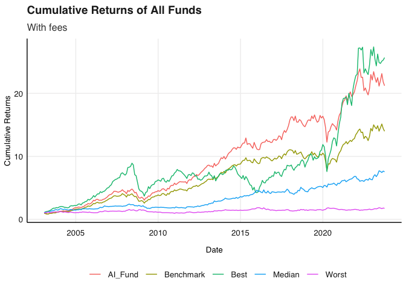

# Purpose

This is the READMe of my practical Examination for Financial
Econometrics

``` r
rm(list = ls()) # Clean your environment:
gc() # garbage collection - It can be useful to call gc after a large object has been removed, as this may prompt R to return memory to the operating system.
```

    ##          used (Mb) gc trigger (Mb) limit (Mb) max used (Mb)
    ## Ncells 464634 24.9     992870 53.1         NA   669311 35.8
    ## Vcells 867507  6.7    8388608 64.0      16384  1840178 14.1

``` r
library(tidyverse)
```

    ## ── Attaching packages ─────────────────────────────────────── tidyverse 1.3.2 ──
    ## ✔ ggplot2 3.4.0     ✔ purrr   1.0.2
    ## ✔ tibble  3.2.1     ✔ dplyr   1.1.2
    ## ✔ tidyr   1.3.0     ✔ stringr 1.5.0
    ## ✔ readr   2.1.4     ✔ forcats 0.5.2
    ## ── Conflicts ────────────────────────────────────────── tidyverse_conflicts() ──
    ## ✖ dplyr::filter() masks stats::filter()
    ## ✖ dplyr::lag()    masks stats::lag()

``` r
list.files('Question 1/code/', full.names = T, recursive = T) %>% .[grepl('.R', .)] %>% as.list() %>% walk(~source(.))
list.files('Question 2/code/', full.names = T, recursive = T) %>% .[grepl('.R', .)] %>% as.list() %>% walk(~source(.))
list.files('Question 3/code/', full.names = T, recursive = T) %>% .[grepl('.R', .)] %>% as.list() %>% walk(~source(.))
list.files('Question 4/code/', full.names = T, recursive = T) %>% .[grepl('.R', .)] %>% as.list() %>% walk(~source(.))
list.files('Question 5/code/', full.names = T, recursive = T) %>% .[grepl('.R', .)] %>% as.list() %>% walk(~source(.))
list.files('Question 6/code/', full.names = T, recursive = T) %>% .[grepl('.R', .)] %>% as.list() %>% walk(~source(.))
```

# Question 1: AI Fund

Please note that I saved my powerpoint in my main question folder as I
have gitignored my data folder so it will not be uploaded to github.

``` r
# Let's read in the data first and foremost and have a look at it
library(tidyverse)
library(lubridate)
```

    ## Loading required package: timechange

    ## 
    ## Attaching package: 'lubridate'

    ## The following objects are masked from 'package:base':
    ## 
    ##     date, intersect, setdiff, union

``` r
library(tbl2xts) 
library(PerformanceAnalytics)
```

    ## Loading required package: xts

    ## Loading required package: zoo

    ## 
    ## Attaching package: 'zoo'

    ## The following objects are masked from 'package:base':
    ## 
    ##     as.Date, as.Date.numeric

    ## 
    ## ######################### Warning from 'xts' package ##########################
    ## #                                                                             #
    ## # The dplyr lag() function breaks how base R's lag() function is supposed to  #
    ## # work, which breaks lag(my_xts). Calls to lag(my_xts) that you type or       #
    ## # source() into this session won't work correctly.                            #
    ## #                                                                             #
    ## # Use stats::lag() to make sure you're not using dplyr::lag(), or you can add #
    ## # conflictRules('dplyr', exclude = 'lag') to your .Rprofile to stop           #
    ## # dplyr from breaking base R's lag() function.                                #
    ## #                                                                             #
    ## # Code in packages is not affected. It's protected by R's namespace mechanism #
    ## # Set `options(xts.warn_dplyr_breaks_lag = FALSE)` to suppress this warning.  #
    ## #                                                                             #
    ## ###############################################################################

    ## 
    ## Attaching package: 'xts'

    ## The following objects are masked from 'package:dplyr':
    ## 
    ##     first, last

    ## 
    ## Attaching package: 'PerformanceAnalytics'

    ## The following object is masked from 'package:graphics':
    ## 
    ##     legend

``` r
library(fmxdat)

ASISA <- read_rds("Question 1/data/ASISA_Rets.rds")
BM <- read_rds("Question 1/data/Capped_SWIX.rds")
AI_Fund <- read_rds("Question 1/data/AI_Max_Fund.rds")

# View(ASISA)
# View(BM)
# View(AI_Fund)
#Notes: We are given monthly returns for all funds 
```

``` r
#Lets start by identifying what I actually want to get done:
# 1) Plot the cumulative returns for all of the funds
# 2) then Plot the actively managed fund including fees
# 3) Plot the 3 year rolling returns (including fees)
# 4) Try and plot the actual distribution of the returns for all three funds
```

``` r
#This code chunk wrangles the data to join all of the returns so we can plot them
# First we need to select managers to compare to, I think it would be a good idea to  get the top of active managers funds as well as the bottom and then  compare to the AI and capped SWIX

strat_active <- ASISA %>% 
    filter(Index == "No") %>% #we do not want any indecies
    filter(FoF == "No") %>%  #We do not want any FoFs
    select(-Index, - FoF)

#Now i need to get the tickers of the funds that have existed since 2005
ticker_to_include <- strat_active %>% 
     filter(date < ymd(20050101)) %>% 
    pull(Fund)

best_active <- strat_active %>% 
    arrange(date) %>% 
    filter(Fund %in% ticker_to_include) %>% #want to make sure that the funds have been around for a comparable amount of time
    group_by(Fund) %>% 
    mutate(avg = mean(Returns)) %>%
    ungroup() %>% # Now we have the average for all the funds 
    filter(date == last(date)) %>% 
    filter(date > lubridate::ymd(20230101)) %>% # I only want funds that exist in 2023 to compare to AI
    filter(avg == max(avg)) %>% #Get the best fund
    pull(Fund)

worst_active <- strat_active %>% 
    arrange(date) %>% 
    filter(Fund %in% ticker_to_include) %>%
    group_by(Fund) %>% 
    mutate(avg = mean(Returns)) %>%
    ungroup() %>% # Now we have the average for all the funds 
    filter(date == last(date)) %>% 
    filter(date > lubridate::ymd(20230101)) %>% # I only want funds that exist in 2023 to compare to AI
    filter(avg == min(avg)) %>% #Get the worst fund
    pull(Fund)

median_active <- 
  strat_active %>% 
    arrange(date) %>% 
    filter(Fund %in% ticker_to_include) %>%
    group_by(Fund) %>% 
    mutate(avg = mean(Returns)) %>%
    ungroup() %>% # Now we have the average for all the funds 
    filter(date == last(date)) %>% 
    filter(date > lubridate::ymd(20230101)) %>% # I only want funds that exist in 2023 to compare to AI
    arrange(avg) %>% # Get the funds with the median average return
    slice(n()/2) %>% 
    pull(Fund)


#Now just clean the managers df
managers <- strat_active %>% 
    filter(Fund %in% c(worst_active, best_active, median_active)) %>% 
    spread(Fund, Returns) %>% 
    rename("Best" = "N924", "Worst" = "V906", "Median" = "B444")


#now I can join all three of the dfs so that I have 1 df to use with all of the returns of interest
full_df <- 
    
    left_join(AI_Fund, managers, by = "date") %>% 
    left_join(., BM %>% select(-Tickers) %>% rename("Benchmark"= "Returns"), by = "date") 

#lets be fancy and use the impute_missing_returns func from the tut to get the returns for the active funds
final_df <- impute_missing_returns(full_df, impute_returns_method = "Drawn_Distribution_Own")

#last but not least lets get it in tidy format
final_df <- final_df %>% gather(Tickers, ret, -date)

#Now we are off to the races and can plot the returns
```

## Fees

``` r
#Lets now just plot the cumulative returns
cum_plot<- final_df %>% 
    arrange(date) %>% 
    group_by(Tickers) %>% 
    mutate(cum_rts = cumprod(1+ret)) %>% 
    select(-ret) %>% 
    ungroup() %>% 
    ggplot()+
    geom_line(aes(date, cum_rts, color = Tickers))+
    fmxdat::theme_fmx()+
    labs(title = "Cumulative Returns of All Funds", subtitle = "Without fees", x = "Date", y = "Cumulative Returns")
```

    ## Warning in loadfonts_win(quiet = quiet): OS is not Windows. No fonts registered
    ## with windowsFonts().

``` r
  #Save it to the graphs folder to use in the powerpoint
# ggsave(file.path("graphs/","Cumulative Returns of All Funds.png"), plot = cum_plot, width = 6, height = 5 )
  
cum_plot
```


``` r
#Now lets add fees on to the actively manaaed portfolios, lets take a fee of 200bps
#Lets include the fee converter func from the prac
 feeconverter <- function(x, Ann_Level) (1+x)^(1/Ann_Level)-1

managers_fees <- managers %>% 
    gather(Tickers, returns, -date) %>% 
    mutate(fee_rts = returns - feeconverter(200*1e-4, Ann_Level = 12)) %>% #using a fee of 25bps
    select(-returns) %>% 
    spread(Tickers, fee_rts) 

#Now we can just join this to the final df
fee_finaldf <- final_df %>% 
    spread(Tickers, ret) %>% 
    select(-Best, -Worst, -Median) %>% 
    left_join(., managers_fees, by = "date")

#Again we can impute missing values
fee_finaldf<- impute_missing_returns(fee_finaldf, impute_returns_method = "Drawn_Distribution_Own")

#Make it tidy to plot again
fee_finaldf<-fee_finaldf %>% 
    gather(Tickers, ret, -date) 

Cum_fee_plot<-fee_finaldf %>% 
arrange(date) %>% 
    group_by(Tickers) %>% 
    mutate(cum_rts = cumprod(1+ret)) %>% 
    select(-ret) %>% 
    ungroup() %>% 
    ggplot()+
    geom_line(aes(date, cum_rts, color = Tickers))+
    fmxdat::theme_fmx()+
    labs(title = "Cumulative Returns of All Funds", subtitle = "With fees", x = "Date", y = "Cumulative Returns")
```

    ## Warning in loadfonts_win(quiet = quiet): OS is not Windows. No fonts registered
    ## with windowsFonts().

``` r
#Save it to the graphs folder to use in the powerpoint
# ggsave(file.path("graphs/","Cumulative Returns of All Funds with fees.png"), plot = Cum_fee_plot, width = 6, height = 5 )

Cum_fee_plot
```

 \##
Rolling Returns

``` r
library(RcppRoll)

#We have monthly returns after fees so we can use the Rcpproll package to get the rolling returns
roll_fee <- fee_finaldf %>% 
    group_by(Tickers) %>% 
    mutate(RollRets = RcppRoll::roll_prod(1 + ret, 24, fill = NA, 
    align = "right")^(12/24) - 1) %>% 
    group_by(date) %>% filter(any(!is.na(RollRets))) %>% 
ungroup()

roll_ret_plot<- 
roll_fee %>% 
ggplot() + 
geom_line(aes(date, RollRets, color = Tickers), alpha = 0.7, 
    size = 1) + 
labs(title = " Rolling 2 Year Annualized Returns", 
    subtitle = "", x = "", y = "Rolling 2 year Returns "
    ) + fmxdat::theme_fmx()
```

    ## Warning: Using `size` aesthetic for lines was deprecated in ggplot2 3.4.0.
    ## ℹ Please use `linewidth` instead.
    ## This warning is displayed once every 8 hours.
    ## Call `lifecycle::last_lifecycle_warnings()` to see where this warning was
    ## generated.

    ## Warning in loadfonts_win(quiet = quiet): OS is not Windows. No fonts registered
    ## with windowsFonts().

``` r
#Save it to the graphs folder to use in the powerpoint
# ggsave(file.path("graphs/","Rolling 2 Year Annualized Returns.png"), plot = roll_ret_plot, width = 6, height = 5 )


roll_ret_plot
```


``` r
#Lets now try and plot the rolling density function with the medians 
roll_density<- roll_fee %>% 
ggplot(aes(x = RollRets)) + 
geom_density(aes(fill = Tickers), alpha =0.6)+
      geom_vline(data = . %>% filter(Tickers == "AI_Fund") %>% summarise(median = median(RollRets)),
             aes(xintercept = median),
             linetype = "dashed", color = "red")+
      geom_vline(data = . %>% filter(Tickers == "Benchmark") %>% summarise(median = median(RollRets)),
             aes(xintercept = median),
             linetype = "dashed", color = "orange")+
      geom_vline(data = . %>% filter(Tickers == "Best") %>% summarise(median = median(RollRets)),
             aes(xintercept = median),
             linetype = "dashed", color = "green")+
      geom_vline(data = . %>% filter(Tickers == "Worst") %>% summarise(median = median(RollRets)),
             aes(xintercept = median),
             linetype = "dashed", color = "purple")+
    geom_vline(data = . %>% filter(Tickers == "Median") %>% summarise(median = median(RollRets)),
             aes(xintercept = median),
             linetype = "dashed", color = "blue")+
    labs(title = " Rolling 2 year densities of the different funds", 
    subtitle = "", x = "", y = "Rolling 2 year Returns "
    ) + fmxdat::theme_fmx()
```

    ## Warning in loadfonts_win(quiet = quiet): OS is not Windows. No fonts registered
    ## with windowsFonts().

``` r
#Save it to the graphs folder to use in the powerpoint
# ggsave(file.path("graphs/","Rolling 2 year densities of the different funds.png"), plot = roll_density, width = 6, height = 5 )

roll_density
```


## Rolling annualized Standard Deviation

``` r
#Now I do the same thing to get the rolling SD
rollsd_fee <- fee_finaldf %>% 
    group_by(Tickers) %>%
    mutate(RollSD = RcppRoll::roll_sd(1 + ret, 36, fill = NA, align = "right") * 
    sqrt(12)) %>% 
filter(!is.na(RollSD))

sd_plot<- rollsd_fee %>% 
ggplot() + 
geom_line(aes(date, RollSD, color = Tickers), alpha = 0.7, size = 1.25) + 
    
labs(title = "Rolling 3 Year Annualized SD ", x = "", y = "Rolling 2 year SD") + theme_fmx()
```

    ## Warning in loadfonts_win(quiet = quiet): OS is not Windows. No fonts registered
    ## with windowsFonts().

``` r
#Save it to the graphs folder to use in the powerpoint
# ggsave(file.path("graphs/","Rolling 2 Year Annualized S.png"), plot = sd_plot, width = 6, height = 5 )


sd_plot
```


# Question 2: Currency Hedging Analysis

``` r
library(tidyverse)
library(fmxdat)
library(PerformanceAnalytics)
library(tbl2xts)
Indexes <- read_rds("Question 2/data/Cncy_Hedge_Assets.rds")
ZAR <- read_rds("Question 2/data/Monthly_zar.rds")
```

## Introduction

I start by replicating the figure given in the article. I then construct
a hedged and un-hedged portfolio, calculate their three year rolling
returns and standard deviation. Lastly, I compare the annualised returns
and standard deviations over three different time periods to show that
the results hold.

``` r
#Lets start by constructing the porfolio, I want to optimise it using quadprog
# library(quadprog)
# #need to get rid of the dates to estimate Sigma
# return_mat_nodate <- data.matrix(Indexes[,-1])
# 
# library(RiskPortfolios)
# library(fitHeavyTail)
# #now use the RiskPortfolios or fitheavy tail packages to get sigma
# 
# HTT <- fitHeavyTail::fit_mvt(return_mat_nodate)
# Sigma <- HTT$cov
# mu <- HTT$mu
# 
# #make sure that the matrix is positive defninite
# Sigma <- as.matrix( Matrix::nearPD(Sigma)$mat)
# #now I am going to construct the amat and bvec to use quadprog to solve there are 4 assets where the first is global equity, the second is global bonds, the third is local equity and the last is local bonds therefore
# Amat <- matrix(c(1, 1, 0, 0, 1,
#                 1, 1, 0, 1, 0,
#                 1, 0, 1, 0, 1,
#                 1, 0, 1, 1, 0), 
#                  nrow = 4, 
#                  byrow = TRUE)
# bvec <- c(1, 0.3, 0.7, 0.4, 0.6 )
# 
# meq = 1 #only the first constraint must hold with equality
# w.opt <- 
#     quadprog::solve.QP(Dmat = Sigma,
#                             dvec = mu, 
#                             Amat = Amat, 
#                             bvec = bvec, 
#                             meq = meq)$solution
# w.opt
# 
# result.QP <- tibble(stocks = colnames(Sigma), weight = w.opt) 


# #That did not work so I am rarther going to use porfolio analytics to construct the optimal portfolio
# library(PortfolioAnalytics)
# library(tbl2xts)
# indexes <- Indexes %>% 
#     tbl_xts()
# 
# specifications <- portfolio.spec(colnames(indexes))
# specifications <- add.constraint(portfolio = specifications, type = "full_investment")
# specifications <- add.constraint(portfolio = specifications, type = "long_only")
# specifications <- add.constraint(portfolio = specifications, type = "group", groups = list(c(1,2)), group_max = 0.3, group_min = 0)
# specifications <- add.constraint(portfolio = specifications, type = "group", groups = list(c(3,4)), group_max = 0.7, group_min = 0)
# specifications <- add.constraint(portfolio = specifications, type = "group", groups = list(c(2,4)), group_max = 0.4, group_min = 0)
# specifications <- add.constraint(portfolio = specifications, type = "group", groups = list(c(1,3)), group_max = 0.6, group_min = 0)
# # specifications<- add.constraint(portfolio=specifications, type="box", min=0, max=c(0.18, 0.12, 0.42, 0.28))
# 
# rand_port <- random_portfolios(portfolio=specifications, permutations = 1000, rp_method ='sample')
# 
# optimal <- optimize.portfolio(R = indexes, portfolio = specifications, optimize_method = "random", rp = rand_port, trace = TRUE)

#This did not work either so i am just going to constrict the weighst by hand that fit the constraints eg offshore bonds can only be 30% of the 40% allocation to bonds

weights <- c(0.18, 0.12, 0.42, 0.28)

#now i am just adding a column with the weights and assuming it is an index rather than a portfolio so there are no rebalancing days
port_ret <- Indexes %>% 
    mutate(MSCI_ACWI_wt = 0.18) %>% 
    mutate(Bbg_Agg_wt = 0.12) %>% 
    mutate(J433_wt = 0.28) %>% 
    mutate(ALBI_wt= 0.28) %>% 
    mutate(port_ret =(MSCI_ACWI*MSCI_ACWI_wt)+ (Bbg_Agg*Bbg_Agg_wt)+ (J433*J433_wt)+(ALBI*ALBI_wt)) %>% 
    select(date, port_ret)

#Now I need to calculate the returns of the dollar rand exchange rate

ex_ret <- ZAR %>% 
    arrange(date) %>% 
    mutate(currency_ret = value/lag(value)-1) %>% 
    select(date, currency_ret) %>% 
    slice(-1)


#now we can join the two data frames
full_df <- port_ret %>% 
    left_join(., ex_ret, by = "date")
```

``` r
#In order to get the percentages on the graph we need to identify how many observations are in each section where the top and bottom left quadrant we also need to consider the fee which appears to be about three percent
countingdf <- full_df %>% 
    na.omit() #This just gets rid of the nas
no_obs <- nrow(countingdf) #get the total number of observations so that we can actually get the percentages

#top right quandrant percentage calculation
TR_perc <- countingdf %>% 
    filter(port_ret >0) %>% 
    filter(currency_ret>0) %>% 
    nrow()/no_obs*100 
TR_perc <- round(TR_perc,0)

#botom right quadrant percentage calculation
BR_perc <- countingdf %>% 
    filter(port_ret <0) %>% 
    filter(currency_ret>0) %>% 
    nrow()/no_obs*100 
 BR_perc<-   round(BR_perc,0)

#top left quandrant percentage calculation
TL_perc <- countingdf %>% 
    filter(port_ret >0) %>% 
    filter(currency_ret<0) %>% 
    nrow()/no_obs*100
 TL_perc<- round(TL_perc,0)

#bottom left quandrant percentage calculation
BL_perc <- countingdf %>% 
    filter(port_ret <0) %>% 
    filter(currency_ret<0) %>% 
    nrow()/no_obs*100 
  BL_perc<-  round(BL_perc,0)

#Top left with fees quandrant percentage calculation
TLF_perc <- countingdf %>% 
    filter(port_ret >0) %>% 
    filter(currency_ret< -0.03) %>% 
    nrow()/no_obs*100 
 TLF_perc<-   round(TLF_perc,0)

#Bottom left with fees quandrant percentage calculation
BLF_perc <- countingdf %>% 
    filter(port_ret <0) %>% 
    filter(currency_ret< -0.03) %>% 
    nrow()/no_obs*100  
  BLF_perc<-  round(BLF_perc,0)

library(ggExtra)
library(glue)
#Now lets actually try and get the plot from ghost 
scatter_plot <- ggplot(full_df)+
    annotate("rect", xmin= 0, xmax = -Inf, ymin = 0, ymax = Inf, fill ="orange", alpha =0.5)+#top left quandrant
    annotate("rect", xmin= 0, xmax = -Inf, ymin = 0, ymax = -Inf, fill ="red", alpha =0.5)+#bottom left quandrant
    annotate("rect", xmin= 0, xmax = Inf, ymin = 0, ymax = Inf, fill ="green", alpha =0.5)+#top right quandrant
    annotate("rect", xmin= 0, xmax = Inf, ymin = 0, ymax = -Inf, fill ="green", alpha =0.2)+#bottom left quandrant
    geom_point(aes(x = currency_ret, y = port_ret), colour = "grey", alpha = 0.8)+
    geom_smooth(aes(x = currency_ret, y = port_ret),method = "lm")+
    geom_hline(yintercept = 0)+
    geom_vline(xintercept = 0)+
    geom_vline(xintercept = -0.03, linetype = "dashed")+
    geom_label(aes(x = -0.1, y = 0.1, label = "Hedge works but, amplifies Volatility"), color = "black", size = 2)+
    geom_label(aes(x = -0.1, y = -0.1, label = "Best case for hedge:\\ higher return lower volatility"), color = "black", size = 2) +
    geom_label(aes(x = 0.1, y = 0.1, label = "Hedge throws away returns"), color = "black", size = 2) +
    geom_label(aes(x = 0.1, y = -0.1, label = "Hedge removes currency cushion"), color = "black", size = 2)+
    geom_label(aes(x = -0.17, y = 0.17, label = glue("{TL_perc}%")), color = "black", size = 3)+
    geom_label(aes(x = -0.17, y = -0.17, label = glue("{BL_perc}%")), color = "black", size = 3)+
    geom_label(aes(x = 0.17, y = 0.17, label = glue("{TR_perc}%")), color = "black", size = 3)+
    geom_label(aes(x = 0.17, y = -0.17, label = glue("{BR_perc}%")), color = "black", size = 3)+
    geom_label(aes(x = -0.17, y = 0.17, label = glue("{TL_perc}%")), color = "black", size = 3)+
    geom_label(aes(x = -0.05, y = -0.17, label = glue("{BLF_perc}%")), color = "black", size = 3)+
    geom_label(aes(x = -0.05, y = 0.17, label = glue("{TLF_perc}%")), color = "black", size = 3)+

    labs(title = "Scatter Plot of USD/ZAR and Portfolio returns ", x = "USD-ZAR Returns", y = "60-40 Local-Global Returns")+
    lims(x = c(-0.2, 0.2), y = c(-0.2, 0.2)) +  # Set axis limits
    theme_bw()


scatter_plot_density <- ggMarginal(scatter_plot, type = "density", margins = "both", fill = "blue")
```

    ## `geom_smooth()` using formula = 'y ~ x'

    ## Warning: Removed 73 rows containing non-finite values (`stat_smooth()`).

    ## `geom_smooth()` using formula = 'y ~ x'

    ## Warning: Removed 73 rows containing non-finite values (`stat_smooth()`).

    ## Warning: Removed 73 rows containing missing values (`geom_point()`).

    ## `geom_smooth()` using formula = 'y ~ x'

    ## Warning: Removed 73 rows containing non-finite values (`stat_smooth()`).
    ## Removed 73 rows containing missing values (`geom_point()`).

``` r
scatter_plot_density
```


# Volatility analysis

``` r
#Lets use the fee converter again assuming that there are fees for hedging assuming the same three percent as above
 feeconverter <- function(x, Ann_Level) (1+x)^(1/Ann_Level)-1

#The hedged return is exactly the return of the global assets less the fee to hedge
hedged<- Indexes %>% 
    mutate(MSCI_ACWI_wt = 0.18) %>% 
    mutate(Bbg_Agg_wt = 0.12) %>% 
    mutate(J433_wt = 0.28) %>% 
    mutate(ALBI_wt= 0.28) %>% 
    mutate(hedged_ret =(MSCI_ACWI*MSCI_ACWI_wt)+ (Bbg_Agg*Bbg_Agg_wt)+ (J433*J433_wt)+(ALBI*ALBI_wt) - feeconverter(300*1e-4, Ann_Level = 12)) %>% 
    select(date, hedged_ret)

unhedged <- Indexes %>% 
    left_join(., ex_ret, by ="date") %>% 
    filter(!is.na(currency_ret)) %>% 
    mutate(MSCI_ACWI_wt = 0.18) %>% 
    mutate(Bbg_Agg_wt = 0.12) %>% 
    mutate(J433_wt = 0.28) %>% 
    mutate(ALBI_wt= 0.28) %>% 
    mutate(unhedged_ret =((MSCI_ACWI*MSCI_ACWI_wt)+ (Bbg_Agg*Bbg_Agg_wt))*currency_ret + (J433*J433_wt)+(ALBI*ALBI_wt)) %>% #here the global assets are subject to the volatility of the rand
    select(date, unhedged_ret)

#Now we can join the dfs so we can compare the returns and the volatility
hedged_comp_df <-
    left_join(unhedged, hedged, by = "date") %>% 
    rename("Hedged"= "hedged_ret", "Unhedged"= "unhedged_ret")

#Lets get the annulised returns for both portfolios
#Start by getting tidy data
tidy_hedged <-hedged_comp_df
```

``` r
#Now lets plot the rollinf returns and SD
#Let's again use the RcppRoll package agin to get annualised reterns and volatility
library(RcppRoll)

roll_ret_hedge <- hedged_comp_df %>% 
    gather(Type, ret, -date) %>% #here type refers to whether it is hedged or not
    group_by(Type) %>% 
    mutate(RollRets = RcppRoll::roll_prod(1 + ret, 24, fill = NA, 
    align = "right")^(12/24) - 1) %>% 
    group_by(date) %>% filter(any(!is.na(RollRets))) %>% 
ungroup()

roll_ret_hedge_plot<- 
roll_ret_hedge %>% 
ggplot() + 
geom_line(aes(date, RollRets, color = Type), alpha = 0.7, 
    size = 1) + 
labs(title = " Rolling 2 Year Annualized Returns", 
    subtitle = "", x = "", y = "Rolling 2 year Returns "
    ) + fmxdat::theme_fmx()
```

    ## Warning in loadfonts_win(quiet = quiet): OS is not Windows. No fonts registered
    ## with windowsFonts().

``` r
roll_ret_hedge_plot
```

 Figure 2
incorporates the fee identified in the study and in Figure Figure 1.
Once the fee has been accounted for it is clear to see the that unhedged
portfolio almost always outperforms it’s hedged counterpart.

``` r
#Now lets get the rolling sd as a measure of volatility

roll_SD_hedge <-  hedged_comp_df %>% 
    gather(Type, ret, -date) %>% 
    group_by(Type) %>%
    mutate(RollSD = RcppRoll::roll_sd(1 + ret, 36, fill = NA, align = "right") * 
    sqrt(12)) %>% 
filter(!is.na(RollSD))

roll_SD_hedge_plot<- roll_SD_hedge %>% 
ggplot() + 
geom_line(aes(date, RollSD, color = Type), alpha = 0.7, size = 1.25) + 
    
labs(title = "Rolling 3 Year Annualized SD ", x = "", y = "Rolling 2 year SD") + theme_fmx()
```

    ## Warning in loadfonts_win(quiet = quiet): OS is not Windows. No fonts registered
    ## with windowsFonts().

``` r
roll_SD_hedge_plot
```

 If the
returns comparison was not convincing enough the comparison of a two
year rolling SD paints an even clearer picture. Throughout the entire
sample period the Hedged portfolio is more risky. Figures 4 and 5 only
strengthen this argument to show that the results are strong
irrespective of the lookback period. Finally the table at the end of the
question calculates the correlations of both portfolios to the USD/ZAR
exchange rate and finds that hedged portfolio is more negatively
correlated to the USD/ZAR exchange rate. This confirms the existence of
the paradox in volatility in that negatively correlated assets may
produce portfolio volatilities that are lower than the sum of its parts.

``` r
#Lets give that table a crack
#Lets get the annulised returns for both portfolios
#Start by getting tidy data
tidy_hedged <-hedged_comp_df %>% 
    gather(Type, ret, -date) %>% 
    tbl_xts(., cols_to_xts = ret, spread_by = Type)

#Now lets use the performance analytics package to get the annulized returns and std devs following the practical 

hedge_plot <- 
    bind_rows(
        tidy_hedged %>% tail(12) %>% PerformanceAnalytics::Return.annualized(., scale = 12) %>% data.frame() %>% mutate(Freq = "A"),
        tidy_hedged %>% tail(36) %>% PerformanceAnalytics::Return.annualized(., scale = 12) %>% data.frame() %>% mutate(Freq = "B"),
        tidy_hedged %>% tail(60) %>% PerformanceAnalytics::Return.annualized(., scale = 12) %>% data.frame() %>% mutate(Freq = "C")
    )%>% data.frame() %>% gather(Type, mu, -Freq)
to_string <- as_labeller(c(`A` = "1 Year", `B` = "3 Years", `C` = "5 Years"))

g <- hedge_plot %>% 
ggplot() + 
    
  geom_bar( aes(Type, mu, fill = Type), stat="identity") + 
    
  facet_wrap(~Freq, labeller = to_string, nrow = 1) + 
    
  labs(x = "", y = "Returns (Ann.)" )+
    theme_fmx()
```

    ## Warning in loadfonts_win(quiet = quiet): OS is not Windows. No fonts registered
    ## with windowsFonts().

``` r
g
```


``` r
#Now I plot a similar graph instead looking at the volatility
hedge_plot_SD <- 
    bind_rows(
        tidy_hedged %>% tail(12) %>% PerformanceAnalytics::StdDev.annualized(., scale = 12) %>% data.frame() %>% mutate(Freq = "A"),
        tidy_hedged %>% tail(36) %>% PerformanceAnalytics::StdDev.annualized(., scale = 12) %>% data.frame() %>% mutate(Freq = "B"),
        tidy_hedged %>% tail(60) %>% PerformanceAnalytics::StdDev.annualized(., scale = 12) %>% data.frame() %>% mutate(Freq = "C")
    )%>% data.frame() %>% gather(Type, mu, -Freq)
to_string <- as_labeller(c(`A` = "1 Year", `B` = "3 Years", `C` = "5 Years"))

Vol_annulised <- hedge_plot_SD %>% 
ggplot() + 
    
  geom_bar( aes(Type, mu, fill = Type), stat="identity") + 
    
  facet_wrap(~Freq, labeller = to_string, nrow = 1) + 
    
  labs(x = "", y = "Vol (Ann.)" )+
    theme_fmx()
```

    ## Warning in loadfonts_win(quiet = quiet): OS is not Windows. No fonts registered
    ## with windowsFonts().

``` r
Vol_annulised
```


``` r
#Lastly I just want to plot the correlations between exchange rate and the portfolios
rho_hedge<- hedged_comp_df %>% 
    left_join(., ex_ret, by = "date") %>% 
    mutate(hedge_rho = cor(Hedged, currency_ret)) %>% 
    mutate(unhedged_rho = cor(Unhedged, currency_ret)) %>% 
    select(date, hedge_rho, unhedged_rho) %>% 
    rename("Hedged"= "hedge_rho", "Unhedged" = "unhedged_rho") %>% 
    gather(Type, Correlation, -date) %>% 
    group_by(Type) %>% 
    summarise(Correlation= mean(Correlation))


kableExtra::kable(rho_hedge)
```

<table>
<thead>
<tr>
<th style="text-align:left;">
Type
</th>
<th style="text-align:right;">
Correlation
</th>
</tr>
</thead>
<tbody>
<tr>
<td style="text-align:left;">
Hedged
</td>
<td style="text-align:right;">
-0.6121116
</td>
</tr>
<tr>
<td style="text-align:left;">
Unhedged
</td>
<td style="text-align:right;">
-0.5452580
</td>
</tr>
</tbody>
</table>
